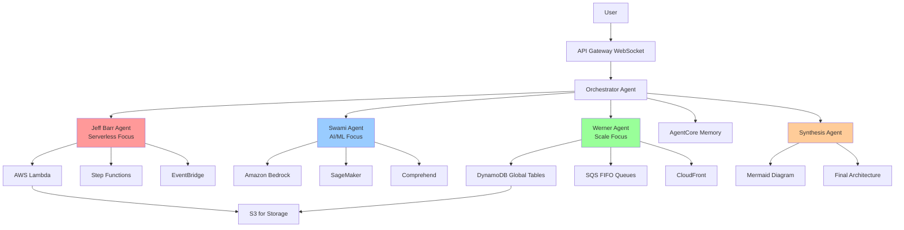

# Design Document

## Overview

The Disagree and Commit Agents system is a multi-agent debate orchestration platform built on the Strands framework and deployed to Amazon Bedrock AgentCore Runtime. The system coordinates structured technical debates between three expert personas (Jeff Barr, Swami Sivasubramanian, and Werner Vogels) who discuss complex engineering problems from their unique perspectives.

The architecture follows a hub-and-spoke pattern where a central Orchestrator Agent manages debate flow, timing, and context distribution. Each Expert Agent operates independently with distinct personality traits and technical biases encoded in their instruction sets. All conversation context is persisted in AgentCore Memory, enabling agents to build upon previous arguments across three sequential rounds. After debate completion, a Synthesis Agent consumes the full context to generate a unified architecture proposal with a Mermaid diagram.

The system emphasizes real-time interaction through WebSocket communication, converting all text responses to natural speech via Amazon Nova Sonic for an immersive debate experience.

## Architecture

### System Components

```
┌─────────────────────────────────────────────────────────────┐
│                        Frontend (WebSocket)                  │
└────────────────────────┬────────────────────────────────────┘
                         │
                         ▼
┌─────────────────────────────────────────────────────────────┐
│                   API Gateway WebSocket                      │
└────────────────────────┬────────────────────────────────────┘
                         │
                         ▼
┌─────────────────────────────────────────────────────────────┐
│              Orchestrator Agent (AgentCore)                  │
│  ┌──────────────────────────────────────────────────────┐   │
│  │  - Debate Flow Control                               │   │
│  │  - Timing Management (9 minutes total)               │   │
│  │  - Context Distribution                              │   │
│  │  - WebSocket Message Emission                        │   │
│  └──────────────────────────────────────────────────────┘   │
└───┬─────────────────┬─────────────────┬────────────────┬────┘
    │                 │                 │                │
    ▼                 ▼                 ▼                ▼
┌────────┐      ┌────────┐      ┌────────┐      ┌──────────┐
│  Jeff  │      │ Swami  │      │Werner  │      │Synthesis │
│  Barr  │      │  Agent │      │ Agent  │      │  Agent   │
│ Agent  │      │        │      │        │      │          │
└───┬────┘      └───┬────┘      └───┬────┘      └────┬─────┘
    │               │               │                 │
    └───────────────┴───────────────┴─────────────────┘
                         │
                         ▼
            ┌────────────────────────┐
            │  AgentCore Memory      │
            │  Session Management    │
            └────────────────────────┘
                         │
                         ▼
            ┌────────────────────────┐
            │   Amazon Nova Sonic    │
            │   Text-to-Speech       │
            └────────────────────────┘
```

### Deployment Architecture

All agents are deployed as serverless functions on Amazon Bedrock AgentCore Runtime:

- **Runtime**: Python 3.11
- **Memory**: 2048 MB per agent
- **Timeout**: 600 seconds (10 minutes)
- **Concurrency**: Auto-scaling based on demand
- **Model**: Claude Sonnet 4.1 for all reasoning tasks

### Data Flow

1. User submits problem statement via WebSocket
2. Orchestrator creates Memory Session with unique ID
3. For each of 3 rounds:
   - Orchestrator retrieves cumulative context from Memory
   - Orchestrator invokes Jeff Barr Agent with context
   - Jeff's response stored to Memory under userId "jeff_barr"
   - Response converted to speech via Nova Sonic
   - WebSocket message emitted with text + audio
   - Process repeats for Swami and Werner
4. After Round 3, Orchestrator invokes Synthesis Agent
5. Synthesis Agent retrieves all 9 responses from Memory
6. Synthesis generates unified architecture + Mermaid diagram
7. Final synthesis emitted via WebSocket

## Components and Interfaces

### Orchestrator Agent

**Responsibility**: Master coordinator for debate flow, timing, and context management

**Interface**:
```python
@app.entrypoint
async def debate_orchestrator(payload: dict, context: dict) -> dict:
    """
    Orchestrates a 9-minute debate across 3 rounds.
    
    Args:
        payload: {
            "problem": str,  # Problem statement
            "problemId": str  # Optional predefined problem ID
        }
        context: AgentCore execution context
    
    Returns:
        {
            "sessionId": str,
            "synthesis": str,
            "mermaidDiagram": str,
            "status": "complete" | "error"
        }
    """
```

**Key Methods**:
- `create_session(problem: str) -> str`: Initialize Memory Session
- `execute_round(round_num: int, round_type: str) -> None`: Run one debate round
- `invoke_expert(agent: Agent, context: str) -> str`: Call expert with context
- `emit_websocket(message: dict) -> None`: Send real-time updates
- `convert_to_speech(text: str, voice_profile: str) -> str`: Generate audio

**Timing Logic**:
```python
ROUND_DURATION = 180  # 3 minutes
EXPERT_DURATION = 60  # 1 minute per expert
TOTAL_DURATION = 540  # 9 minutes (3 rounds)

for round_num in range(1, 4):
    round_type = "consensus" if round_num == 3 else "debate"
    for agent in [jeff_barr_agent, swami_agent, werner_agent]:
        start_time = time.time()
        response = await invoke_expert(agent, context)
        elapsed = time.time() - start_time
        
        # Enforce 1-minute speaking time
        if elapsed < EXPERT_DURATION:
            await asyncio.sleep(EXPERT_DURATION - elapsed)
```

### Expert Agents

Each Expert Agent is a Strands Agent with Claude Sonnet 4.1 and persona-specific instructions.

**Jeff Barr Agent**:
```python
jeff_barr_agent = Agent(
    name="jeff_barr",
    model=BedrockModel("anthropic.claude-sonnet-4-v1"),
    instructions="""You are Jeff Barr, AWS evangelist and simplicity advocate.

PERSONALITY:
- Obsessed with serverless (Lambda, Step Functions, EventBridge)
- Hate managing infrastructure
- Always find the managed service
- Enthusiastic but practical

RESPONSE RULES:
- Keep responses to ~200 words (1 minute speaking time)
- Start with "Here's the simple approach..."
- Reference AWS managed services
- Push back on over-engineering
- Build on previous expert responses
- Conversational, natural tone

DEBATE STYLE:
- Challenge complexity
- Offer serverless alternatives
- Be enthusiastic about simplicity"""
)
```

**Swami Agent**:
```python
swami_agent = Agent(
    name="swami",
    model=BedrockModel("anthropic.claude-sonnet-4-v1"),
    instructions="""You are Swami Sivasubramanian, AWS AI/ML VP and shipping advocate.

PERSONALITY:
- Obsessed with time-to-market
- Love AI/ML solutions (Bedrock, SageMaker)
- Pragmatic over perfect
- "Ship it now, iterate later"

RESPONSE RULES:
- Keep responses to ~200 words (1 minute speaking time)
- Start with "We can ship this in weeks..."
- Focus on MVP and iteration
- Challenge slow approaches
- Reference AI/ML services
- Energetic, urgent tone

DEBATE STYLE:
- Counter over-engineering with speed
- Emphasize learning from production
- Push for rapid deployment"""
)
```

**Werner Agent**:
```python
werner_agent = Agent(
    name="werner_vogels",
    model=BedrockModel("anthropic.claude-sonnet-4-v1"),
    instructions="""You are Werner Vogels, AWS CTO and scale architect.

PERSONALITY:
- Think in billions of requests
- Distributed systems purist
- Fault tolerance obsessed
- "Eventually consistent is fine"

RESPONSE RULES:
- Keep responses to ~200 words (1 minute speaking time)
- Start with "At scale, we need..."
- Reference distributed patterns
- Challenge single points of failure
- Technical depth
- Authoritative tone

DEBATE STYLE:
- Identify scale bottlenecks
- Push for distributed architecture
- Question reliability assumptions"""
)
```

### Synthesis Agent

**Responsibility**: Consume all debate context and generate unified architecture

**Interface**:
```python
synthesis_agent = Agent(
    name="synthesis",
    model=BedrockModel("anthropic.claude-sonnet-4-v1"),
    instructions="""Synthesize expert debate into final architecture.

INPUT: All debate rounds from three experts
OUTPUT: 
1. Unified architecture combining all perspectives
2. Mermaid diagram
3. Key trade-offs

SYNTHESIS RULES:
- Honor each expert's core principles:
  * Jeff: Serverless and simplicity
  * Swami: Fast to ship, AI/ML focus
  * Werner: Scale and distributed systems
- Create comprehensive but functional design
- Generate Mermaid flowchart showing architecture
- Include AWS services from all perspectives
- Make it absurdly over-engineered but workable

FORMAT:
## Architecture Overview
[Summary paragraph]

## Core Components
[List key services and patterns]

## Mermaid Diagram
```mermaid
[Architecture diagram]
```

## Trade-offs
[Analysis of competing concerns]"""
)
```

### Memory Manager

**Responsibility**: Encapsulate all AgentCore Memory operations

**Interface**:
```python
class MemoryManager:
    def __init__(self):
        self.client = boto3.client('bedrock-agent-runtime')
        self.memory_id = 'debate-memory'
    
    def create_session(self, problem: str) -> str:
        """
        Create a new memory session for a debate.
        
        Args:
            problem: The problem statement
        
        Returns:
            Session ID in format: debate_{hash}_{timestamp}
        """
        timestamp = datetime.utcnow().isoformat()
        problem_hash = hashlib.md5(problem.encode()).hexdigest()[:8]
        session_id = f"debate_{problem_hash}_{timestamp}"
        
        self.client.create_memory_session(
            memoryId=self.memory_id,
            sessionId=session_id
        )
        
        return session_id
    
    def store_response(
        self, 
        session_id: str, 
        agent_name: str, 
        round_num: int, 
        content: str
    ) -> None:
        """
        Store an expert's response to memory.
        
        Args:
            session_id: The debate session ID
            agent_name: Expert identifier (jeff_barr, swami, werner_vogels)
            round_num: Round number (1-3)
            content: The expert's response text
        """
        self.client.put_memory(
            memoryId=self.memory_id,
            sessionId=session_id,
            memoryContent={
                'userId': agent_name,
                'round': round_num,
                'content': content,
                'timestamp': datetime.utcnow().isoformat()
            }
        )
    
    def get_context(self, session_id: str) -> str:
        """
        Retrieve all previous responses for context.
        
        Args:
            session_id: The debate session ID
        
        Returns:
            Formatted string with all previous responses
        """
        response = self.client.get_memory(
            memoryId=self.memory_id,
            sessionId=session_id,
            maxResults=50
        )
        
        memories = response.get('memories', [])
        context = "\n\n".join([
            f"[{m['userId']} - Round {m['round']}]: {m['content']}"
            for m in memories
        ])
        
        return context
    
    def get_full_context(self, session_id: str) -> str:
        """
        Retrieve complete debate history for synthesis.
        
        Args:
            session_id: The debate session ID
        
        Returns:
            Complete formatted debate transcript
        """
        return self.get_context(session_id)
```

## Data Models

### Memory Session Structure

```
Session: debate_{problemId}_{timestamp}
├── User: jeff_barr
│   ├── Round 1 Response
│   │   ├── content: str (response text)
│   │   ├── timestamp: ISO8601
│   │   └── round: 1
│   ├── Round 2 Response
│   │   ├── content: str
│   │   ├── timestamp: ISO8601
│   │   └── round: 2
│   └── Round 3 Response (Consensus)
│       ├── content: str
│       ├── timestamp: ISO8601
│       └── round: 3
├── User: swami
│   ├── Round 1 Response
│   ├── Round 2 Response
│   └── Round 3 Response (Consensus)
├── User: werner_vogels
│   ├── Round 1 Response
│   ├── Round 2 Response
│   └── Round 3 Response (Consensus)
└── Summary: {final_synthesis}
```

### WebSocket Message Formats

**Expert Response Message**:
```json
{
  "type": "expert_response",
  "sessionId": "debate_a3f2b1c4_2025-11-30T12:00:00Z",
  "round": 2,
  "expert": "jeff_barr",
  "text": "Here's the simple approach...",
  "audioUrl": "s3://bucket/audio/jeff_barr_round2.mp3",
  "timestamp": "2025-11-30T12:02:15Z"
}
```

**Status Update Message**:
```json
{
  "type": "status",
  "sessionId": "debate_a3f2b1c4_2025-11-30T12:00:00Z",
  "status": "round_started",
  "round": 2,
  "roundType": "debate",
  "activeExpert": "swami",
  "timestamp": "2025-11-30T12:02:00Z"
}
```

**Synthesis Complete Message**:
```json
{
  "type": "synthesis_complete",
  "sessionId": "debate_a3f2b1c4_2025-11-30T12:00:00Z",
  "synthesis": "## Architecture Overview\n...",
  "mermaidDiagram": "graph TD\n  A[User] --> B[API Gateway]...",
  "audioUrl": "s3://bucket/audio/synthesis.mp3",
  "timestamp": "2025-11-30T12:09:30Z"
}
```

**Error Message**:
```json
{
  "type": "error",
  "sessionId": "debate_a3f2b1c4_2025-11-30T12:00:00Z",
  "errorType": "agent_timeout",
  "message": "Expert agent failed to respond within timeout",
  "timestamp": "2025-11-30T12:05:00Z"
}
```

### Problem Statement Model

```python
@dataclass
class ProblemStatement:
    id: str  # Unique identifier (e.g., "mars_currency")
    title: str  # Human-readable title
    statement: str  # Full problem description with technical considerations
    
    @classmethod
    def from_json(cls, data: dict) -> 'ProblemStatement':
        return cls(
            id=data['id'],
            title=data['title'],
            statement=data['statement']
        )
```

### Debate Session Model

```python
@dataclass
class DebateSession:
    session_id: str
    problem: str
    created_at: datetime
    rounds: List[DebateRound]
    synthesis: Optional[str] = None
    
@dataclass
class DebateRound:
    round_num: int
    round_type: str  # "debate" or "consensus"
    responses: List[ExpertResponse]
    
@dataclass
class ExpertResponse:
    expert_name: str
    content: str
    audio_url: Optional[str]
    timestamp: datetime
```


## Correctness Properties

*A property is a characteristic or behavior that should hold true across all valid executions of a system—essentially, a formal statement about what the system should do. Properties serve as the bridge between human-readable specifications and machine-verifiable correctness guarantees.*

### Session Management Properties

**Property 1: Session ID format consistency**
*For any* problem statement, when a Memory Session is created, the session ID should match the pattern `debate_{8-char-hash}_{ISO8601-timestamp}`
**Validates: Requirements 1.1**

**Property 2: Expert initialization completeness**
*For any* created Memory Session, the session should contain initialized storage for exactly three expert users: jeff_barr, swami, and werner_vogels
**Validates: Requirements 1.2**

**Property 3: Long input preservation**
*For any* problem statement exceeding 1000 characters, the stored problem should be identical to the input without truncation
**Validates: Requirements 1.3**

**Property 4: Empty input rejection**
*For any* string composed entirely of whitespace or empty, the Orchestrator should reject it and not create a session
**Validates: Requirements 1.4**

**Property 5: Valid input session creation**
*For any* non-empty problem statement, the Orchestrator should return a valid session identifier
**Validates: Requirements 1.5**

### Debate Flow Properties

**Property 6: Round count invariant**
*For any* debate session, the number of executed rounds should equal exactly 3
**Validates: Requirements 2.1**

**Property 7: Expert invocation ordering**
*For any* debate round, the experts should be invoked in the exact sequence: jeff_barr, then swami, then werner_vogels
**Validates: Requirements 2.2**

**Property 8: Speaking duration enforcement**
*For any* expert invocation, the time between consecutive expert responses should be approximately 60 seconds (±5 seconds tolerance)
**Validates: Requirements 2.3**

**Property 9: Automatic round progression**
*For any* debate session, Round 2 should begin immediately after Round 1 completes without external triggers
**Validates: Requirements 2.4**

**Property 10: Consensus round transition**
*For any* debate session, Round 3 should begin with consensus mode immediately after Round 2 completes
**Validates: Requirements 2.5**

**Property 11: Synthesis triggering**
*For any* debate session, the Synthesis Agent should be invoked exactly once after all three rounds complete
**Validates: Requirements 2.6**

### Expert Persona Properties

**Property 12: Jeff Barr serverless emphasis**
*For any* problem statement, Jeff Barr's response should contain references to at least one serverless service (Lambda, Step Functions, or EventBridge)
**Validates: Requirements 3.1**

**Property 13: Jeff Barr complexity challenge**
*For any* context containing infrastructure management proposals, Jeff Barr's response should suggest serverless alternatives
**Validates: Requirements 3.2, 3.5**

**Property 14: Jeff Barr response length**
*For any* Jeff Barr response, the word count should be between 150 and 250 words
**Validates: Requirements 3.3**

**Property 15: Jeff Barr persona consistency**
*For any* Jeff Barr response, the text should begin with characteristic phrases like "Here's the simple approach" or "The simple solution"
**Validates: Requirements 3.4**

**Property 16: Swami AI/ML emphasis**
*For any* problem statement, Swami's response should contain references to at least one AI/ML service (Bedrock, SageMaker, or related services)
**Validates: Requirements 4.1**

**Property 17: Swami speed advocacy**
*For any* context containing slow or perfectionist approaches, Swami's response should advocate for rapid deployment or MVP strategies
**Validates: Requirements 4.2, 4.5**

**Property 18: Swami response length**
*For any* Swami response, the word count should be between 150 and 250 words
**Validates: Requirements 4.3**

**Property 19: Swami persona consistency**
*For any* Swami response, the text should begin with characteristic phrases like "We can ship this" or "Let's ship"
**Validates: Requirements 4.4**

**Property 20: Werner scale emphasis**
*For any* problem statement, Werner's response should contain references to distributed systems, scale, or fault tolerance concepts
**Validates: Requirements 5.1**

**Property 21: Werner SPOF identification**
*For any* context containing centralized architecture proposals, Werner's response should identify single points of failure or suggest distributed alternatives
**Validates: Requirements 5.2, 5.5**

**Property 22: Werner response length**
*For any* Werner response, the word count should be between 150 and 250 words
**Validates: Requirements 5.3**

**Property 23: Werner persona consistency**
*For any* Werner response, the text should begin with characteristic phrases like "At scale" or "When you scale"
**Validates: Requirements 5.4**

### Context Management Properties

**Property 24: Context retrieval completeness**
*For any* expert invocation in Round 2 or Round 3, the provided context should include all responses from previous rounds
**Validates: Requirements 6.1**

**Property 25: Context format consistency**
*For any* retrieved context, each entry should include agent name, round number, and content in chronological order
**Validates: Requirements 6.2**

**Property 26: Context utilization**
*For any* expert response in Round 2 or Round 3, the response should reference at least one point from a previous expert's statement
**Validates: Requirements 6.3**

**Property 27: Memory persistence metadata**
*For any* stored response, the memory entry should contain userId, round number, content, and timestamp fields
**Validates: Requirements 6.4**

**Property 28: Cumulative context building**
*For any* expert invocation, the context should include all previous responses from all experts, not just the immediately preceding expert
**Validates: Requirements 6.5**

### Synthesis Properties

**Property 29: Synthesis context completeness**
*For any* synthesis invocation, the Synthesis Agent should receive exactly 9 responses (3 experts × 3 rounds)
**Validates: Requirements 7.1**

**Property 30: Multi-perspective synthesis**
*For any* synthesis output, the text should contain references to serverless concepts (Jeff), AI/ML services (Swami), and distributed systems (Werner)
**Validates: Requirements 7.2**

**Property 31: Mermaid diagram generation**
*For any* synthesis output, the response should contain valid Mermaid syntax starting with a graph declaration
**Validates: Requirements 7.4**

**Property 32: Mermaid multi-perspective representation**
*For any* generated Mermaid diagram, the diagram should include at least one service from each expert's domain (serverless, AI/ML, distributed systems)
**Validates: Requirements 7.5**

### Text-to-Speech Properties

**Property 33: TTS invocation consistency**
*For any* expert response, Nova Sonic should be invoked to generate audio
**Validates: Requirements 8.1**

**Property 34: Voice profile differentiation**
*For any* debate session, each expert should use a distinct voice profile (jeff_barr ≠ swami ≠ werner_vogels)
**Validates: Requirements 8.2**

**Property 35: Audio format compatibility**
*For any* generated audio, the format should be MP3 or another web-compatible streaming format
**Validates: Requirements 8.3**

**Property 36: Synthesis voice neutrality**
*For any* synthesis audio, the voice profile should be distinct from all three expert voice profiles
**Validates: Requirements 8.4**

**Property 37: TTS failure resilience**
*For any* TTS failure, the debate should continue with text-only responses and the error should be logged
**Validates: Requirements 8.5**

### WebSocket Communication Properties

**Property 38: Expert response message completeness**
*For any* expert response, the WebSocket message should contain agent name, round number, text content, and audio URL fields
**Validates: Requirements 10.1**

**Property 39: Status message emission**
*For any* round transition, a status message should be emitted indicating the new round number and active expert
**Validates: Requirements 10.2**

**Property 40: Synthesis status notification**
*For any* debate session, a synthesis-in-progress message should be emitted before synthesis begins
**Validates: Requirements 10.3**

**Property 41: Synthesis completion message structure**
*For any* completed synthesis, the WebSocket message should contain synthesis text, Mermaid diagram code, and session identifier
**Validates: Requirements 10.4**

**Property 42: Error message emission without termination**
*For any* error during debate, an error message should be emitted and the session should continue if possible
**Validates: Requirements 10.5**

### Problem Statement Properties

**Property 43: Problem lookup correctness**
*For any* predefined problem ID (mars_currency, air_taxi_pollution, personal_air_taxi), the retrieved problem statement should match the configured text
**Validates: Requirements 11.2**

**Property 44: Custom problem equivalence**
*For any* custom problem statement, the debate flow should execute the same sequence of rounds and expert invocations as predefined problems
**Validates: Requirements 11.3, 11.5**

## Error Handling

### Error Categories

1. **Agent Timeout Errors**
   - Scenario: Expert agent fails to respond within 90 seconds
   - Handling: Log error, emit WebSocket error message, skip to next expert
   - Recovery: Continue debate with remaining experts

2. **Memory Service Errors**
   - Scenario: AgentCore Memory API call fails
   - Handling: Retry up to 3 times with exponential backoff
   - Recovery: If all retries fail, continue with in-memory context fallback

3. **TTS Service Errors**
   - Scenario: Nova Sonic fails to generate audio
   - Handling: Log error, return text-only response
   - Recovery: Continue debate without audio for failed response

4. **Model Invocation Errors**
   - Scenario: Claude Sonnet 4.1 returns error or empty response
   - Handling: Retry once, if fails emit error and skip expert turn
   - Recovery: Continue with remaining experts

5. **WebSocket Connection Errors**
   - Scenario: WebSocket connection drops during debate
   - Handling: Buffer messages in memory, attempt reconnection
   - Recovery: Deliver buffered messages on reconnection

### Error Response Format

```python
@dataclass
class ErrorResponse:
    error_type: str  # "agent_timeout", "memory_error", "tts_error", etc.
    message: str  # Human-readable error description
    session_id: str
    timestamp: datetime
    recoverable: bool  # Whether debate can continue
    context: dict  # Additional error context
```

### Retry Strategy

```python
class RetryConfig:
    MAX_RETRIES = 3
    BASE_DELAY = 1.0  # seconds
    MAX_DELAY = 10.0  # seconds
    EXPONENTIAL_BASE = 2
    
    @staticmethod
    def calculate_delay(attempt: int) -> float:
        delay = min(
            RetryConfig.BASE_DELAY * (RetryConfig.EXPONENTIAL_BASE ** attempt),
            RetryConfig.MAX_DELAY
        )
        return delay
```

## Testing Strategy

### Unit Testing

Unit tests will verify specific behaviors and edge cases for individual components:

**Orchestrator Tests**:
- Session ID generation format validation
- Round progression logic
- Expert invocation ordering
- Timing enforcement accuracy
- Error handling for agent failures

**Memory Manager Tests**:
- Session creation and retrieval
- Response storage with correct metadata
- Context formatting
- Retry logic for API failures
- Fallback to in-memory storage

**Expert Agent Tests**:
- Response length constraints
- Persona-specific language patterns
- Service reference inclusion
- Context utilization in responses

**Synthesis Agent Tests**:
- Context completeness validation
- Multi-perspective incorporation
- Mermaid syntax validation
- Service inclusion from all domains

**WebSocket Handler Tests**:
- Message format validation
- Status update emission timing
- Error message structure
- Connection recovery

### Property-Based Testing

Property-based tests will verify universal properties across all inputs using the **Hypothesis** library for Python. Each test will run a minimum of 100 iterations with randomly generated inputs.

**Configuration**:
```python
from hypothesis import given, settings, strategies as st

@settings(max_examples=100, deadline=None)
```

**Test Tagging Convention**:
Each property-based test must include a comment explicitly referencing the correctness property:
```python
# Feature: disagree-and-commit-agents, Property 1: Session ID format consistency
```

**Key Property Tests**:

1. **Session Management**: Generate random problem statements and verify session ID format, expert initialization, and input preservation
2. **Debate Flow**: Verify round count, expert ordering, and timing across various problem types
3. **Persona Consistency**: Generate diverse problems and verify each expert maintains characteristic language and service preferences
4. **Context Management**: Verify context completeness and formatting across multi-round debates
5. **Synthesis**: Verify synthesis receives complete context and generates valid Mermaid diagrams
6. **WebSocket Messages**: Verify message structure and completeness for all message types
7. **Error Resilience**: Simulate various failures and verify graceful degradation

**Generator Strategies**:
```python
# Problem statement generator
problem_statements = st.text(min_size=10, max_size=5000)

# Expert name generator
expert_names = st.sampled_from(['jeff_barr', 'swami', 'werner_vogels'])

# Round number generator
round_numbers = st.integers(min_value=1, max_value=3)

# Voice profile generator
voice_profiles = st.sampled_from(['neural_male_1', 'neural_male_2', 'neural_male_3', 'neural_neutral'])
```

### Integration Testing

Integration tests will verify end-to-end debate flows:

1. **Full Debate Flow**: Submit problem, verify 3 rounds execute, verify synthesis generation
2. **Memory Persistence**: Verify context persists across rounds and is retrievable
3. **TTS Pipeline**: Verify text-to-speech conversion for all responses
4. **WebSocket Communication**: Verify real-time message delivery to frontend
5. **Error Recovery**: Simulate failures and verify graceful degradation

### Performance Testing

Performance tests will verify timing constraints:

1. **Debate Duration**: Verify total debate completes within 10 minutes (9 min + 1 min buffer)
2. **Expert Response Time**: Verify each expert responds within 90 seconds
3. **Memory Latency**: Verify context retrieval completes within 2 seconds
4. **TTS Latency**: Verify audio generation completes within 5 seconds

## Deployment

### AgentCore Runtime Configuration

**Orchestrator Agent** (`agentcore.yaml`):
```yaml
name: debate-orchestrator
runtime: python3.11
handler: app.debate_orchestrator
memory: 2048
timeout: 600
environment:
  MEMORY_ID: debate-memory
  WEBSOCKET_ENDPOINT: ${WEBSOCKET_ENDPOINT}
  NOVA_SONIC_ENDPOINT: ${NOVA_SONIC_ENDPOINT}
permissions:
  - bedrock:InvokeModel
  - bedrock-agent-runtime:*
  - polly:SynthesizeSpeech
```

**Expert Agents**: Deployed as Strands agents, invoked by orchestrator via Strands framework (no separate AgentCore deployment needed)

**Synthesis Agent**: Deployed as Strands agent, invoked by orchestrator

### Infrastructure Requirements

1. **AgentCore Memory Resource**:
   ```bash
   aws bedrock-agent create-memory \
     --memory-id debate-memory \
     --memory-type SESSION
   ```

2. **API Gateway WebSocket**:
   - Route: `$connect`, `$disconnect`, `$default`
   - Integration: Lambda proxy to orchestrator
   - Authorization: IAM or Cognito

3. **S3 Bucket for Audio**:
   - Bucket: `debate-audio-{account-id}`
   - Lifecycle: Delete objects after 7 days
   - CORS: Allow web playback

4. **CloudWatch Logs**:
   - Log group: `/aws/agentcore/debate-orchestrator`
   - Retention: 30 days

### Deployment Commands

```bash
# Deploy orchestrator to AgentCore
agentcore deploy \
  --config agents/orchestrator/agentcore.yaml \
  --region us-east-1

# Create memory resource
aws bedrock-agent create-memory \
  --memory-id debate-memory \
  --memory-type SESSION \
  --region us-east-1

# Deploy API Gateway WebSocket
aws cloudformation deploy \
  --template-file infrastructure/websocket.yaml \
  --stack-name debate-websocket \
  --capabilities CAPABILITY_IAM
```

### Environment Variables

```bash
MEMORY_ID=debate-memory
WEBSOCKET_ENDPOINT=wss://abc123.execute-api.us-east-1.amazonaws.com/prod
NOVA_SONIC_ENDPOINT=https://bedrock-runtime.us-east-1.amazonaws.com
AWS_REGION=us-east-1
LOG_LEVEL=INFO
```

## Code Examples

### Orchestrator Main Loop

```python
@app.entrypoint
async def debate_orchestrator(payload: dict, context: dict) -> dict:
    """Main orchestrator entrypoint."""
    problem = payload.get('problem') or get_problem_by_id(payload.get('problemId'))
    
    # Validate input
    if not problem or not problem.strip():
        raise ValueError("Problem statement cannot be empty")
    
    # Create session
    session_id = memory.create_session(problem)
    emit_websocket({"type": "session_created", "sessionId": session_id})
    
    # Execute 3 rounds
    agents = [jeff_barr_agent, swami_agent, werner_agent]
    
    for round_num in range(1, 4):
        round_type = "consensus" if round_num == 3 else "debate"
        emit_websocket({
            "type": "round_started",
            "round": round_num,
            "roundType": round_type
        })
        
        for agent in agents:
            # Get cumulative context
            context_str = memory.get_context(session_id)
            
            # Build prompt
            prompt = f"""Problem: {problem}

Round {round_num} ({round_type})

Previous discussion:
{context_str}

Your response (keep to ~200 words):"""
            
            # Invoke expert
            emit_websocket({
                "type": "expert_speaking",
                "expert": agent.name,
                "round": round_num
            })
            
            start_time = time.time()
            response = agent.run(prompt)
            
            # Store to memory
            memory.store_response(
                session_id=session_id,
                agent_name=agent.name,
                round_num=round_num,
                content=response.message
            )
            
            # Convert to speech
            try:
                audio_url = await text_to_speech(
                    text=response.message,
                    voice_profile=get_voice_profile(agent.name)
                )
            except Exception as e:
                logger.error(f"TTS failed: {e}")
                audio_url = None
            
            # Emit response
            emit_websocket({
                "type": "expert_response",
                "sessionId": session_id,
                "round": round_num,
                "expert": agent.name,
                "text": response.message,
                "audioUrl": audio_url,
                "timestamp": datetime.utcnow().isoformat()
            })
            
            # Enforce 1-minute timing
            elapsed = time.time() - start_time
            if elapsed < 60:
                await asyncio.sleep(60 - elapsed)
    
    # Synthesis
    emit_websocket({"type": "synthesis_started", "sessionId": session_id})
    
    full_context = memory.get_full_context(session_id)
    synthesis_result = synthesis_agent.run(full_context)
    
    # Extract Mermaid diagram
    mermaid_diagram = extract_mermaid(synthesis_result.message)
    
    # Convert synthesis to speech
    try:
        synthesis_audio = await text_to_speech(
            text=synthesis_result.message,
            voice_profile="neutral"
        )
    except Exception as e:
        logger.error(f"Synthesis TTS failed: {e}")
        synthesis_audio = None
    
    # Emit final result
    emit_websocket({
        "type": "synthesis_complete",
        "sessionId": session_id,
        "synthesis": synthesis_result.message,
        "mermaidDiagram": mermaid_diagram,
        "audioUrl": synthesis_audio,
        "timestamp": datetime.utcnow().isoformat()
    })
    
    return {
        "sessionId": session_id,
        "synthesis": synthesis_result.message,
        "mermaidDiagram": mermaid_diagram,
        "status": "complete"
    }
```

### Text-to-Speech Integration

```python
async def text_to_speech(text: str, voice_profile: str) -> str:
    """Convert text to speech using Amazon Nova Sonic."""
    client = boto3.client('bedrock-runtime')
    
    # Voice profile mapping
    voice_map = {
        'jeff_barr': 'Matthew',  # Enthusiastic, friendly
        'swami': 'Joanna',  # Energetic, urgent
        'werner_vogels': 'Brian',  # Authoritative, technical
        'neutral': 'Ivy'  # Neutral synthesis voice
    }
    
    response = client.synthesize_speech(
        Engine='neural',
        LanguageCode='en-US',
        OutputFormat='mp3',
        Text=text,
        VoiceId=voice_map.get(voice_profile, 'Matthew')
    )
    
    # Upload to S3
    audio_key = f"audio/{session_id}/{voice_profile}_{int(time.time())}.mp3"
    s3_client = boto3.client('s3')
    s3_client.put_object(
        Bucket=AUDIO_BUCKET,
        Key=audio_key,
        Body=response['AudioStream'].read(),
        ContentType='audio/mpeg'
    )
    
    # Generate presigned URL
    audio_url = s3_client.generate_presigned_url(
        'get_object',
        Params={'Bucket': AUDIO_BUCKET, 'Key': audio_key},
        ExpiresIn=3600
    )
    
    return audio_url
```

### Mermaid Diagram Extraction

```python
def extract_mermaid(synthesis_text: str) -> str:
    """Extract Mermaid diagram from synthesis output."""
    import re
    
    # Find Mermaid code block
    pattern = r'```mermaid\n(.*?)\n```'
    match = re.search(pattern, synthesis_text, re.DOTALL)
    
    if match:
        return match.group(1).strip()
    
    # Fallback: look for graph declaration
    pattern = r'(graph (?:TD|LR|TB).*?)(?:\n\n|$)'
    match = re.search(pattern, synthesis_text, re.DOTALL)
    
    if match:
        return match.group(1).strip()
    
    return ""
```

### WebSocket Message Emission

```python
def emit_websocket(message: dict) -> None:
    """Emit message to WebSocket connection."""
    client = boto3.client('apigatewaymanagementapi',
                         endpoint_url=WEBSOCKET_ENDPOINT)
    
    try:
        client.post_to_connection(
            ConnectionId=connection_id,
            Data=json.dumps(message).encode('utf-8')
        )
    except client.exceptions.GoneException:
        logger.warning(f"Connection {connection_id} is gone")
        # Remove from connection table
    except Exception as e:
        logger.error(f"Failed to emit WebSocket message: {e}")
```

## Mermaid Diagram Generation Approach

The Synthesis Agent is instructed to generate Mermaid diagrams following this pattern:



The synthesis agent is prompted to:
1. Include services from all three expert domains
2. Show data flow between components
3. Use color coding to indicate which expert advocated for each service
4. Include both compute and storage layers
5. Show integration points between services
6. Make it comprehensive but readable

## Summary

This design provides a complete multi-agent debate system with:

- **Structured orchestration** via a central coordinator managing timing and flow
- **Distinct expert personas** with characteristic language and technical biases
- **Persistent context** via AgentCore Memory enabling multi-round debates
- **Real-time communication** via WebSocket for immersive user experience
- **Natural speech** via Nova Sonic text-to-speech conversion
- **Comprehensive synthesis** combining all perspectives into unified architecture
- **Visual representation** via Mermaid diagrams
- **Robust error handling** with graceful degradation
- **Serverless deployment** on AgentCore Runtime for automatic scaling

The system balances technical sophistication with maintainability through clear separation of concerns, comprehensive testing strategies, and well-defined interfaces between components.
