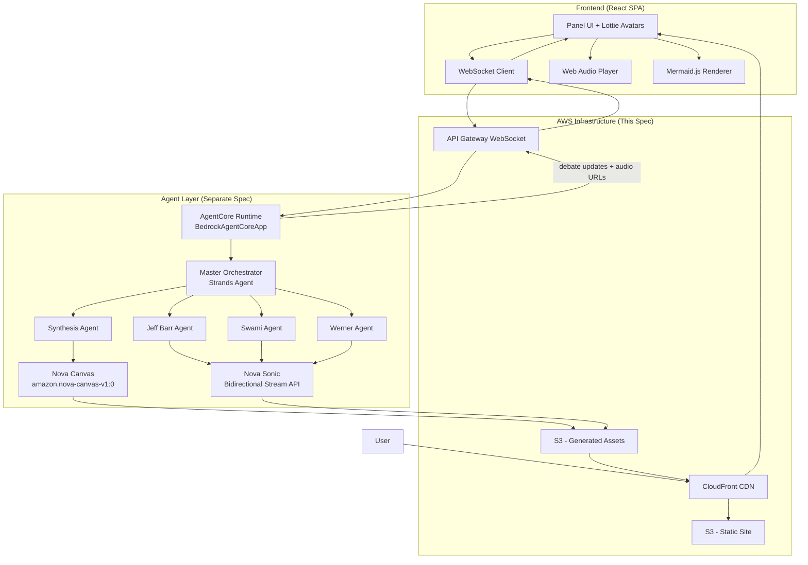

# Design Document: Disagree and Commit - UI & Infrastructure

## Overview

"Disagree and Commit" is a comedic web application where three AI-powered AWS expert personas (Jeff Barr, Swami, Werner Vogels) debate how to architect any user-submitted engineering problem. The debate escalates through frustration levels until they "disagree and commit" to a gloriously over-engineered solution, presented as a Mermaid architecture diagram.

This spec covers the **frontend UI** and **AWS infrastructure** components. The agent layer (AgentCore, Strands SDK, expert personalities, orchestration) is covered in a separate spec at `.kiro/specs/disagree-and-commit-agents/`.

### Tech Stack (aligned with disagree-and-commit.md)

**Frontend:**
- React + TypeScript + Vite
- TailwindCSS for styling
- Lottie for avatar animations (idle, speaking, frustrated states)
- Mermaid.js for architecture diagram rendering
- Web Audio API for Nova Sonic audio playback

**AWS Infrastructure:**
- **API Gateway WebSocket API** - Real-time bidirectional communication with route selection expression `$request.body.action`
- **S3** - Static site hosting + generated assets storage (audio, images)
- **CloudFront** - CDN for static assets and generated content

**Backend (Agent Team Spec - see `.kiro/specs/disagree-and-commit-agents/`):**
- **Amazon Bedrock AgentCore Runtime** - Serverless agent deployment using `BedrockAgentCoreApp` wrapper
- **Strands Agents SDK** - Model-driven orchestration framework with native AWS integrations
- **Amazon Nova Sonic** - Speech-to-speech model via Bedrock's bidirectional streaming API for expert voice responses
- **Amazon Nova Canvas** - Image generation model (model ID: `amazon.nova-canvas-v1:0`) for reaction images and architecture diagrams

## Architecture



## Components and Interfaces

### Frontend Components

#### 1. PanelDisplay Component
Renders the three expert avatars with Lottie animations in a horizontal grid.

```typescript
interface PanelDisplayProps {
  experts: Expert[];
  speakingExpertId: string | null;
  frustrationLevels: Record<string, FrustrationLevel>;
}

interface Expert {
  id: 'jeff' | 'swami' | 'werner';
  name: string;
  title: string;
  color: string; // 'orange' | 'blue' | 'purple'
  catchphrase: string;
  badge: string;
  avatarImage: string; // Static fallback image
  lottieAnimations: {
    idle: string;      // Lottie JSON URL
    speaking: string;  // Lottie JSON URL
    frustrated: Record<FrustrationLevel, string>; // Lottie JSON URLs per level
  };
}

type FrustrationLevel = 1 | 2 | 3 | 4 | 5;
```

#### 2. ProblemInput Component
Text input for submitting engineering problems to the panel.

```typescript
interface ProblemInputProps {
  onSubmit: (problem: string) => void;
  isDebateInProgress: boolean;
  isLoading: boolean;
}
```

#### 3. DebateDisplay Component
Real-time streaming display of expert responses with typewriter effect and audio playback.

```typescript
interface DebateDisplayProps {
  messages: DebateMessage[];
  currentStreamingMessage: StreamingMessage | null;
  onPlayAudio: (audioUrl: string) => void;
}

interface DebateMessage {
  id: string;
  expertId: string;
  content: string;
  audioUrl?: string;  // Nova Sonic generated audio URL from S3
  reactionImageUrl?: string; // Nova Canvas generated image URL
  timestamp: number;
  isDisagreement: boolean;
}

interface StreamingMessage {
  expertId: string;
  partialContent: string;
}
```

#### 4. AudioPlayer Component
Plays Nova Sonic generated voice responses for each expert.

```typescript
interface AudioPlayerProps {
  audioUrl: string | null;
  expertId: string;
  onComplete: () => void;
  autoPlay: boolean;
}
```

#### 5. FrustrationMeter Component
Visual indicator of each expert's frustration level with escalating effects.

```typescript
interface FrustrationMeterProps {
  expertId: string;
  level: FrustrationLevel;
  onFinaleTriggered?: () => void;
}
```

#### 6. ArchitectureReveal Component
Dramatic reveal of the final Mermaid diagram with cost estimate and downloadable assets.

```typescript
interface ArchitectureRevealProps {
  isRevealed: boolean;
  mermaidDiagram: string;
  costEstimate: CostEstimate;
  expertEndorsements: Record<string, string>;
  assetsFolder: AssetsFolder;
  onDownload: (assetType: 'diagram' | 'all') => void;
}

interface CostEstimate {
  monthly: number;
  breakdown: ServiceCost[];
  satiricalNote: string; // e.g., "This is actually cheaper than your current Kubernetes cluster"
}

interface ServiceCost {
  service: string;
  cost: number;
  justification: string; // e.g., "47 Lambda functions for 'flexibility'"
}

interface AssetsFolder {
  diagramPngUrl: string;
  mermaidSourceUrl: string;
}
```

#### 7. WebSocketClient Service
Manages real-time connection to API Gateway WebSocket using route selection expression `$request.body.action`.

```typescript
interface WebSocketClient {
  connect(sessionId: string): Promise<void>;
  sendMessage(action: string, payload: Record<string, unknown>): void;
  onMessage(handler: (message: WebSocketMessage) => void): void;
  disconnect(): void;
}

// Messages sent TO backend (action field for route selection)
interface ClientMessage {
  action: 'submitProblem';
  problem: string;
  sessionId: string;
}

// Messages received FROM backend
type WebSocketMessage =
  | { type: 'expert_speaking'; expertId: string }
  | { type: 'expert_response'; expertId: string; content: string; audioUrl?: string; isComplete: boolean }
  | { type: 'frustration_update'; expertId: string; level: FrustrationLevel; reactionImageUrl?: string }
  | { type: 'round_complete'; roundNumber: number }
  | { type: 'disagree_and_commit' }
  | { type: 'architecture_ready'; diagram: string; cost: CostEstimate; endorsements: Record<string, string>; assets: AssetsFolder };
```

### AWS Infrastructure Components

#### API Gateway WebSocket API
Routes configured with selection expression `$request.body.action`:

| Route Key | Description | Integration |
|-----------|-------------|-------------|
| `$connect` | Client connects, store connectionId | Lambda → DynamoDB |
| `$disconnect` | Client disconnects, cleanup | Lambda → DynamoDB |
| `submitProblem` | User submits engineering problem | Lambda → AgentCore |
| `$default` | Fallback for unknown actions | Lambda (error response) |

#### S3 Buckets

**Static Site Bucket:**
- React SPA build artifacts
- Lottie animation JSON files
- Expert avatar images
- Bucket policy for CloudFront OAI access

**Assets Bucket:**
- Nova Sonic audio files (`.mp3`, `.wav`)
- Nova Canvas generated images (`.png`)
- Exported Mermaid diagrams (`.png`, `.svg`)
- CORS configured for frontend access

#### CloudFront Distribution
- **Origin 1**: Static site bucket (default behavior `/*`)
- **Origin 2**: Assets bucket (path pattern `/assets/*`)
- HTTPS only, TLS 1.2+
- Cache behaviors optimized for static vs dynamic content

## Data Models

### Debate Session (stored in DynamoDB by Agent Layer)
```typescript
interface DebateSession {
  sessionId: string;        // Partition key
  connectionId: string;     // API Gateway connection ID
  problem: string;
  status: 'pending' | 'in_progress' | 'completed';
  currentRound: number;
  frustrationLevels: Record<string, FrustrationLevel>;
  messages: DebateMessage[];
  finalArchitecture?: FinalArchitecture;
  createdAt: number;
  ttl: number;              // Auto-cleanup after 24 hours
}

interface FinalArchitecture {
  mermaidDiagram: string;
  costEstimate: CostEstimate;
  expertEndorsements: Record<string, string>;
  assetsFolder: AssetsFolder;
  generatedAt: number;
}
```

### Expert Configuration
```typescript
const EXPERTS: Expert[] = [
  {
    id: 'jeff',
    name: 'Jeff Barr',
    title: 'The Simplifier',
    color: 'orange',
    catchphrase: 'But why?',
    badge: 'Keep it Simple',
    avatarImage: '/avatars/jeff.png',
    lottieAnimations: {
      idle: '/lottie/jeff-idle.json',
      speaking: '/lottie/jeff-speaking.json',
      frustrated: {
        1: '/lottie/jeff-calm.json',
        2: '/lottie/jeff-concerned.json',
        3: '/lottie/jeff-annoyed.json',
        4: '/lottie/jeff-frustrated.json',
        5: '/lottie/jeff-steam.json'
      }
    }
  },
  {
    id: 'swami',
    name: 'Swami',
    title: 'The Shipper',
    color: 'blue',
    catchphrase: 'Just ship it!',
    badge: 'Ship It!',
    avatarImage: '/avatars/swami.png',
    lottieAnimations: { /* similar structure */ }
  },
  {
    id: 'werner',
    name: 'Werner Vogels',
    title: 'The Scale Architect',
    color: 'purple',
    catchphrase: "Won't scale!",
    badge: 'Scale or Fail',
    avatarImage: '/avatars/werner.png',
    lottieAnimations: { /* similar structure */ }
  }
];
```

## Correctness Properties

*A property is a characteristic or behavior that should hold true across all valid executions of a system-essentially, a formal statement about what the system should do. Properties serve as the bridge between human-readable specifications and machine-verifiable correctness guarantees.*

### Property 1: Expert Styling Consistency
*For any* expert who speaks, their speech bubble SHALL have the correct color class and badge indicator matching their configuration (Jeff=orange/"Keep it Simple", Swami=blue/"Ship It!", Werner=purple/"Scale or Fail").

**Validates: Requirements 3.2, 8.1, 8.2, 8.3**

### Property 2: Input State Management
*For any* debate state (pending, in_progress, completed), the problem input field SHALL be disabled if and only if the state is 'in_progress'.

**Validates: Requirements 2.2, 2.3**

### Property 3: WebSocket Message Routing
*For any* valid WebSocket message received from the backend, the message SHALL be routed to the correct handler based on its type field, and the corresponding UI state SHALL be updated.

**Validates: Requirements 4.3**

### Property 4: Frustration Display Consistency
*For any* frustration level update, the UI SHALL display the correct visual state for that level, and dramatic effects SHALL be active if and only if the level is 4 or higher.

**Validates: Requirements 5.2, 5.4**

### Property 5: Mermaid Diagram Validity
*For any* final architecture received from the backend, the mermaidDiagram string SHALL be valid Mermaid syntax that renders without errors.

**Validates: Requirements 6.2**

### Property 6: Expert Catchphrase Display
*For any* disagreement message from an expert, the UI SHALL display that expert's configured catchphrase.

**Validates: Requirements 8.4**

## Error Handling

| Error Scenario | Handling Strategy |
|----------------|-------------------|
| WebSocket connection fails | Display "Connection lost" banner, show retry button |
| Empty problem submitted | Inline validation error, prevent submission |
| Audio fails to load | Continue without audio, show text only |
| Mermaid diagram fails to render | Display raw diagram text with error message |
| Asset download fails | Show error toast, allow retry |

## Testing Strategy

### Unit Tests
- Component rendering tests for each UI component
- WebSocket message parsing tests
- Expert configuration validation
- Lottie animation loading
- Audio player controls

### Property-Based Tests
Using **fast-check** for TypeScript property-based testing:

1. **Expert Styling Property Test**: Generate random expert IDs and verify correct styling is applied
2. **Input State Property Test**: Generate random debate states and verify input disabled state
3. **Message Routing Property Test**: Generate random valid message types and verify correct handler invocation
4. **Frustration Effects Property Test**: Generate random frustration levels and verify effects activation
5. **Mermaid Validity Property Test**: Generate architecture data and verify valid Mermaid output
6. **Catchphrase Property Test**: Generate disagreement scenarios and verify catchphrase display

Each property-based test SHALL run a minimum of 100 iterations and be tagged with the format: `**Feature: disagree-and-commit-ui, Property {number}: {property_text}**`

