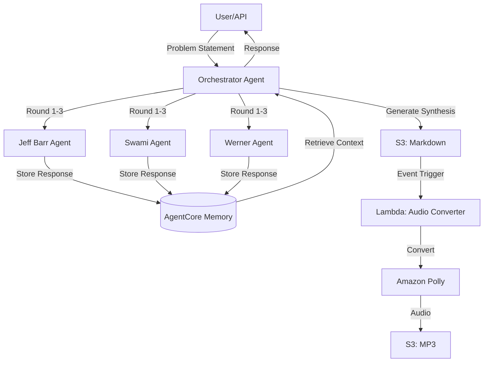

# Design Document

## Overview

This design document describes the disagree-and-commit agents system that orchestrates debates between three AWS expert personas (Jeff Barr, Swami Sivasubramanian, and Werner Vogels). The system processes problem statements through a structured 3-round debate, stores conversations in AgentCore Memory, generates synthesis documents in S3, and automatically converts them to audio using Amazon Polly.

**Key Components:**
1. Orchestrator Agent - Coordinates debate flow
2. Expert Persona Agents - Jeff Barr, Swami Sivasubramanian, Werner Vogels
3. AgentCore Memory - Conversation persistence
4. S3 Storage - Markdown transcripts and audio files
5. Lambda Function - Audio conversion using Polly
6. Synthesis Process - Combines perspectives into unified architecture

## Architecture

### System Flow



### Component Structure

```
agents/
├── experts/
│   ├── jeff_barr.py           # Jeff Barr expert agent (serverless focus)
│   ├── swami.py               # Swami agent (AI/ML focus)
│   └── werner_vogels.py       # Werner agent (scale focus)
├── memory/
│   └── session_manager.py     # AgentCore Memory integration
├── orchestrator/
│   └── app.py                 # Main orchestrator (AgentCore Runtime)
├── synthesis/
│   └── synthesizer.py         # Synthesis agent
└── lambda/
    └── audio_converter.py     # Lambda function for Polly conversion
```

### S3 Storage Structure

```
road-to-reinvent-redteam/
├── {sessionId}/
│   ├── conversation_response/
│   │   └── debate_synthesis.md
│   └── audio_response/
│       └── debate_synthesis.mp3
```

### Key Design Principles

1. **Event-Driven Architecture**: S3 upload triggers Lambda for audio conversion
2. **Serverless-First**: All components run on serverless infrastructure
3. **Memory Persistence**: All conversations stored in AgentCore Memory
4. **Asynchronous Processing**: Audio conversion happens independently of orchestrator
5. **Structured Debate**: 3 rounds ensure thorough exploration of problem space

## System Flow

### Phase 1: Debate Orchestration

1. **Input**: User provides problem statement
2. **Session Creation**: Generate unique session ID `debate_<hash>_<timestamp>`
3. **Round 1 (Debate)**: Each expert provides initial position
   - Jeff Barr → Memory
   - Swami → Memory (with Jeff's context)
   - Werner → Memory (with Jeff + Swami context)
4. **Round 2 (Debate)**: Each expert responds to others
   - All agents retrieve full Round 1 context
   - Provide rebuttals and refinements
5. **Round 3 (Consensus)**: Work toward agreement
   - All agents retrieve Rounds 1-2 context
   - Find common ground and synthesis points

### Phase 2: Synthesis Generation

1. **Context Retrieval**: Get complete transcript from Memory
2. **Synthesis Agent**: Process all responses
3. **Document Generation**: Create markdown with:
   - Problem statement
   - Complete debate transcript
   - Unified architecture
   - Mermaid diagram
   - Trade-offs analysis

### Phase 3: Storage and Audio Conversion

1. **S3 Upload**: Store markdown to `{sessionId}/conversation_response/`
2. **Event Trigger**: S3 notifies Lambda
3. **Lambda Processing**:
   - Read markdown from S3
   - Convert to plain text
   - Split into chunks (3000 char limit)
   - Call Polly for each chunk
   - Combine audio segments
4. **Audio Upload**: Store MP3 to `{sessionId}/audio_response/`

### Phase 4: Response

Return to user:
- Session ID
- Synthesis text
- Mermaid diagram
- S3 paths for markdown and audio
- Status

## Components and Interfaces

### Orchestrator Agent (app.py)

**Purpose**: Main coordinator for debate process

**Interface**:
```python
@app.entrypoint
async def debate_orchestrator(payload: dict, context: dict) -> dict:
    """
    Args:
        payload: {
            "problem": str,
            "problemId": str (optional),
            "actor_id": str (optional)
        }
    
    Returns: {
        "sessionId": str,
        "status": "complete" | "error",
        "synthesis": str,
        "mermaidDiagram": str,
        "s3Paths": {
            "markdown": str,
            "audio": str
        },
        "audioStatus": "processing" | "complete"
    }
    """
```

**Responsibilities**:
- Create session in AgentCore Memory
- Execute 3 rounds of debate
- Invoke expert agents sequentially
- Store responses to Memory
- Generate synthesis
- Upload to S3
- Return results

### Expert Agents (jeff_barr.py, swami.py, werner_vogels.py)

**Current Pattern (Incorrect):**
```python
from strands.models import BedrockModel

agent = Agent(
    model=BedrockModel(model_id="anthropic.claude-sonnet-4-v1"),
    system_prompt="..."
)
agent.name = "agent_name"
```

**New Pattern (Correct):**
```python
from strands import Agent
from strands.models.bedrock import BedrockModel

agent = Agent(
    name="agent_name",
    model=BedrockModel(
        model_id="us.anthropic.claude-sonnet-4-20250514-v1:0",
        temperature=0.7,
        max_tokens=2048
    ),
    system_prompt="..."
)
```

**Interface:**
- Input: String prompt
- Output: Response object with `message['content'][0]['text']` structure
- Invocation: `response = agent(prompt)`

### Memory Manager (session_manager.py)

**Current Pattern (Incorrect):**
```python
self.client.put_memory(
    memoryId=self.memory_id,
    sessionId=session_id,
    memoryContent={...}
)
```

**New Pattern (Correct):**
```python
client = boto3.client('bedrock-agent-runtime', region_name=REGION)
client.create_event(
    memoryId=memory_id,
    actorId=actor_id,
    sessionId=session_id,
    messages=[
        {"role": "USER", "text": "..."},
        {"role": "ASSISTANT", "text": "..."}
    ]
)
```

**Interface:**
```python
class MemoryManager:
    def __init__(self, memory_id: str, region: str = 'us-east-1')
    def create_session(self, problem: str, actor_id: str) -> str
    def store_response(self, session_id: str, actor_id: str, round_num: int, content: str) -> None
    def get_context(self, session_id: str, actor_id: str) -> str
    def get_full_context(self, session_id: str, actor_id: str) -> str
```

### Orchestrator (app.py)

**Current Pattern (Incorrect):**
```python
response = agent.run(prompt)
response_text = response.message
```

**New Pattern (Correct):**
```python
response = agent(prompt)
response_text = response.message['content'][0]['text']
```

**Entrypoint Signature:**
```python
@app.entrypoint
def debate_orchestrator(payload: dict, context) -> dict:
    """
    Args:
        payload: {
            "problem": str,
            "problemId": str (optional),
            "actor_id": str (optional, default: "orchestrator")
        }
        context: AgentCore context object
    
    Returns: {
        "sessionId": str,
        "synthesis": str,
        "mermaidDiagram": str,
        "status": "complete" | "error",
        "error": str (if status is "error")
    }
    """
```

### Synthesis Agent (synthesizer.py)

**Purpose**: Combines all expert perspectives into unified architecture

**Configuration**:
```python
synthesis_agent = Agent(
    name="synthesis",
    model=BedrockModel(
        model_id="us.anthropic.claude-sonnet-4-20250514-v1:0",
        temperature=0.7,
        max_tokens=2048
    ),
    system_prompt="Synthesize expert debate into final architecture..."
)
```

**Invocation Pattern**:
```python
response = synthesis_agent(prompt)
synthesis_text = response.message['content'][0]['text']
mermaid_diagram = extract_mermaid(synthesis_text)
```

### S3 Storage Component

**Bucket**: `road-to-reinvent-redteam`

**Upload Pattern**:
```python
s3_client.put_object(
    Bucket='road-to-reinvent-redteam',
    Key=f'{session_id}/conversation_response/debate_synthesis.md',
    Body=markdown_content,
    ContentType='text/markdown',
    Metadata={
        'session-id': session_id,
        'timestamp': timestamp,
        'status': 'complete'
    }
)
```

**Event Notification**:
- Trigger: ObjectCreated on `*/conversation_response/*.md`
- Target: Lambda function ARN
- Events: `s3:ObjectCreated:*`

### Lambda Audio Converter (audio_converter.py)

**Purpose**: Convert markdown transcripts to audio using Polly

**Trigger**: S3 event notification

**Process Flow**:
```python
def lambda_handler(event, context):
    # 1. Extract S3 details from event
    bucket = event['Records'][0]['s3']['bucket']['name']
    key = event['Records'][0]['s3']['object']['key']
    
    # 2. Read markdown from S3
    markdown_content = s3_client.get_object(Bucket=bucket, Key=key)['Body'].read()
    
    # 3. Convert markdown to plain text
    plain_text = markdown_to_text(markdown_content)
    
    # 4. Split into chunks (Polly 3000 char limit)
    chunks = split_text(plain_text, max_length=3000)
    
    # 5. Convert each chunk with Polly
    audio_segments = []
    for chunk in chunks:
        response = polly_client.synthesize_speech(
            Text=chunk,
            OutputFormat='mp3',
            VoiceId='Matthew',
            Engine='neural',
            SampleRate='24000'
        )
        audio_segments.append(response['AudioStream'].read())
    
    # 6. Combine audio segments
    combined_audio = combine_audio_segments(audio_segments)
    
    # 7. Upload MP3 to S3
    session_id = extract_session_id(key)
    output_key = f'{session_id}/audio_response/debate_synthesis.mp3'
    
    s3_client.put_object(
        Bucket=bucket,
        Key=output_key,
        Body=combined_audio,
        ContentType='audio/mpeg'
    )
    
    return {'statusCode': 200, 'output_key': output_key}
```

**Configuration**:
- Runtime: Python 3.11
- Memory: 512 MB
- Timeout: 5 minutes
- Environment Variables:
  - `POLLY_VOICE_ID`: Matthew
  - `POLLY_ENGINE`: neural
  - `POLLY_SAMPLE_RATE`: 24000

**IAM Permissions**:
- `s3:GetObject` on source bucket
- `s3:PutObject` on destination bucket
- `polly:SynthesizeSpeech`

## Data Models

### Agent Response Structure

```python
{
    "message": {
        "content": [
            {
                "text": "Agent response text here..."
            }
        ]
    }
}
```

### Memory Event Structure

```python
{
    "memoryId": "memory-resource-id",
    "actorId": "agent-identifier",
    "sessionId": "session-identifier",
    "messages": [
        {
            "role": "USER",
            "text": "User message or prompt"
        },
        {
            "role": "ASSISTANT",
            "text": "Agent response"
        }
    ]
}
```

### Memory Retrieval Structure

```python
{
    "memories": [
        {
            "content": {
                "text": "Memory content"
            },
            "metadata": {...}
        }
    ]
}
```

### Orchestrator Payload Structure

```python
{
    "problem": "Problem statement text",
    "problemId": "optional-predefined-id",
    "actor_id": "optional-actor-identifier"
}
```

### Orchestrator Response Structure

```python
{
    "sessionId": "debate_hash_timestamp",
    "status": "complete" | "error",
    "synthesis": "Full synthesis text with architecture",
    "mermaidDiagram": "Mermaid diagram code",
    "s3Paths": {
        "markdown": "road-to-reinvent-redteam/{sessionId}/conversation_response/debate_synthesis.md",
        "audio": "road-to-reinvent-redteam/{sessionId}/audio_response/debate_synthesis.mp3"
    },
    "audioStatus": "processing" | "complete",
    "actor_id": "orchestrator",
    "error": "Error message (if status is error)"
}
```

### Markdown Document Structure

```markdown
# Debate Synthesis: {Problem Statement}

## Session Information
- Session ID: {sessionId}
- Date: {timestamp}
- Participants: Jeff Barr, Swami Sivasubramanian, Werner Vogels

## Problem Statement
{original problem}

## Debate Transcript

### Round 1: Initial Positions
**Jeff Barr (Serverless Advocate):**
{response}

**Swami Sivasubramanian (AI/ML Innovator):**
{response}

**Werner Vogels (Scale Architect):**
{response}

### Round 2: Rebuttals
...

### Round 3: Consensus
...

## Unified Architecture

### Overview
{synthesis of all perspectives}

### Core Components
{combined architecture elements}

### Mermaid Diagram
```mermaid
{architecture diagram}
```

### Trade-offs
{analysis of competing concerns}
```

### S3 Event Structure

```python
{
    "Records": [
        {
            "s3": {
                "bucket": {
                    "name": "road-to-reinvent-redteam"
                },
                "object": {
                    "key": "{sessionId}/conversation_response/debate_synthesis.md",
                    "size": 12345
                }
            },
            "eventName": "ObjectCreated:Put"
        }
    ]
}
```

## Correctness Properties

*A property is a characteristic or behavior that should hold true across all valid executions of a system-essentially, a formal statement about what the system should do. Properties serve as the bridge between human-readable specifications and machine-verifiable correctness guarantees.*

### Property 1: Debate Completeness

*For any* valid problem statement, the orchestrator should execute exactly 3 rounds with all 3 expert agents, resulting in 9 total agent invocations.

**Validates: Requirements 1.2, 1.3**

### Property 2: Memory Storage Round Trip

*For any* valid session_id, actor_id, and content string, storing a response to memory and then retrieving context should include that content in the returned context string.

**Validates: Requirements 3.2, 3.4**

### Property 3: Session ID Format

*For any* generated session ID, it should meet the minimum length requirement (33 characters) and follow the format pattern "debate_<hash>_<timestamp>".

**Validates: Requirements 3.1**

### Property 4: Agent Response Structure

*For any* expert agent invocation with a valid prompt, the response should have the structure `message['content'][0]['text']` containing a non-empty string.

**Validates: Requirements 2.6**

### Property 5: S3 Path Structure

*For any* successful debate, the S3 paths should follow the pattern `{bucket}/{sessionId}/conversation_response/debate_synthesis.md` and `{bucket}/{sessionId}/audio_response/debate_synthesis.mp3`.

**Validates: Requirements 5.2, 6.6**

### Property 6: Synthesis Completeness

*For any* synthesis document, it should include problem statement, all 3 rounds of debate, unified architecture, Mermaid diagram, and trade-offs analysis.

**Validates: Requirements 4.2, 4.3, 4.4, 4.5**

### Property 7: Error Handling Preservation

*For any* agent invocation that fails, the system should catch the exception, log it, and continue execution with a fallback message without crashing the entire debate.

**Validates: Requirements 8.1, 8.2**

### Property 8: Audio Conversion Trigger

*For any* markdown file uploaded to S3 at path `{sessionId}/conversation_response/*.md`, the Lambda function should be triggered and produce an MP3 file at `{sessionId}/audio_response/*.mp3`.

**Validates: Requirements 6.1, 6.6**

### Property 9: Orchestrator Response Completeness

*For any* successful debate execution, the orchestrator response should contain all required fields: sessionId, status, synthesis, mermaidDiagram, and s3Paths.

**Validates: Requirements 1.7**

### Property 10: Context Accumulation

*For any* round N > 1, each expert agent should receive context from all previous rounds (1 through N-1) before generating their response.

**Validates: Requirements 1.4, 3.5**

## Error Handling

### Agent Invocation Errors

**Strategy:** Try-except blocks around agent calls with fallback messages

```python
try:
    response = agent(prompt)
    response_text = response.message['content'][0]['text']
except Exception as e:
    logger.error(f"Error invoking {agent.name}: {e}")
    response_text = f"[Agent {agent.name} failed to respond]"
```

### Memory Operation Errors

**Strategy:** Retry with exponential backoff, log errors, continue execution

```python
try:
    memory.store_response(session_id, actor_id, round_num, content)
except Exception as e:
    logger.error(f"Error storing response: {e}")
    # Continue execution - memory failure shouldn't stop debate
```

### Environment Variable Errors

**Strategy:** Use defaults and log warnings

```python
MEMORY_ID = os.getenv('MEMORY_ID')
if not MEMORY_ID:
    logger.warning("MEMORY_ID not set, memory operations may fail")
```

### Response Structure Errors

**Strategy:** Defensive extraction with fallbacks

```python
try:
    response_text = response.message['content'][0]['text']
except (KeyError, TypeError, IndexError) as e:
    logger.error(f"Error extracting response text: {e}")
    response_text = str(response)  # Fallback to string representation
```

## Testing Strategy

### Unit Testing

**Expert Agents:**
- Test agent initialization with correct parameters
- Test agent invocation with sample prompts
- Test response structure extraction
- Mock BedrockModel to avoid API calls

**Memory Manager:**
- Test session creation with various inputs
- Test response storage with correct message format
- Test context retrieval and formatting
- Mock boto3 client for isolated testing

**Orchestrator:**
- Test payload validation
- Test round execution logic
- Test error handling for agent failures
- Mock expert agents and memory manager

**Synthesis Agent:**
- Test synthesis invocation
- Test Mermaid extraction from various formats
- Test error handling

### Integration Testing

**End-to-End Flow:**
- Test complete debate flow with real agents (if possible)
- Test memory persistence across rounds
- Test synthesis generation
- Verify response structure

**Memory Integration:**
- Test actual AgentCore Memory operations (if memory resource available)
- Test session creation and retrieval
- Test context accumulation

### Property-Based Testing

Property-based tests will be implemented using the `hypothesis` library for Python.

**Test Configuration:**
- Minimum 100 iterations per property test
- Use appropriate generators for strings, session IDs, etc.
- Tag each test with the property it validates

**Property Test Examples:**

```python
from hypothesis import given, strategies as st

@given(st.text(min_size=1))
def test_agent_invocation_returns_valid_structure(prompt):
    """Property 1: Agent Invocation Consistency"""
    response = agent(prompt)
    assert 'message' in response.message
    assert 'content' in response.message['message']
    assert len(response.message['message']['content']) > 0
    assert 'text' in response.message['message']['content'][0]
    assert isinstance(response.message['message']['content'][0]['text'], str)
```

## Implementation Notes

### Migration Path

1. Update expert agent files first (low risk, isolated changes)
2. Update memory manager (medium risk, affects orchestrator)
3. Update orchestrator (high risk, integrates all changes)
4. Update synthesis agent (low risk, similar to expert agents)
5. Update tests to match new patterns

### Backward Compatibility

- Maintain existing function signatures where possible
- Add new parameters with defaults
- Deprecate old patterns with warnings

### Configuration Management

**Environment Variables:**
- `MEMORY_ID`: AgentCore Memory resource ID (required for memory operations)
- `MODEL_ID`: Bedrock model identifier (default: "us.anthropic.claude-sonnet-4-20250514-v1:0")
- `AWS_REGION`: AWS region (default: "us-east-1")

**Logging:**
```python
import logging

logging.basicConfig(
    level=logging.INFO,
    format='%(asctime)s [%(levelname)s] %(name)s: %(message)s'
)
logger = logging.getLogger(__name__)
```

### Performance Considerations

- Agent invocations are synchronous and sequential (by design for debate flow)
- Memory operations use retry logic to handle transient failures
- Session IDs are generated deterministically for reproducibility
- Context retrieval fetches all memories (consider pagination for very long debates)

## Deployment

### Step 1: Deploy AgentCore Memory

```bash
# Create memory resource
aws bedrock-agent create-memory \
  --memory-name disagree-and-commit-memory \
  --region us-east-1

# Note the memory ID for next steps
```

### Step 2: Create and Configure S3 Bucket

```bash
# Create bucket
aws s3 mb s3://road-to-reinvent-redteam

# Enable versioning
aws s3api put-bucket-versioning \
  --bucket road-to-reinvent-redteam \
  --versioning-configuration Status=Enabled

# Configure lifecycle policy (optional)
aws s3api put-bucket-lifecycle-configuration \
  --bucket road-to-reinvent-redteam \
  --lifecycle-configuration file://lifecycle-policy.json
```

### Step 3: Deploy Lambda Function

```bash
# Package Lambda
cd lambda
pip install -r requirements.txt -t .
zip -r function.zip .

# Create Lambda function
aws lambda create-function \
  --function-name debate-audio-converter \
  --runtime python3.11 \
  --handler audio_converter.lambda_handler \
  --zip-file fileb://function.zip \
  --role arn:aws:iam::ACCOUNT:role/lambda-execution-role \
  --timeout 300 \
  --memory-size 512 \
  --environment Variables="{POLLY_VOICE_ID=Matthew,POLLY_ENGINE=neural}"
```

### Step 4: Configure S3 Event Notification

```bash
# Add Lambda permission for S3 invocation
aws lambda add-permission \
  --function-name debate-audio-converter \
  --statement-id s3-invoke \
  --action lambda:InvokeFunction \
  --principal s3.amazonaws.com \
  --source-arn arn:aws:s3:::road-to-reinvent-redteam

# Configure S3 event notification
aws s3api put-bucket-notification-configuration \
  --bucket road-to-reinvent-redteam \
  --notification-configuration file://s3-event-config.json
```

**s3-event-config.json**:
```json
{
  "LambdaFunctionConfigurations": [
    {
      "LambdaFunctionArn": "arn:aws:lambda:us-east-1:ACCOUNT:function:debate-audio-converter",
      "Events": ["s3:ObjectCreated:*"],
      "Filter": {
        "Key": {
          "FilterRules": [
            {"Name": "prefix", "Value": ""},
            {"Name": "suffix", "Value": "/conversation_response/debate_synthesis.md"}
          ]
        }
      }
    }
  ]
}
```

### Step 5: Deploy Orchestrator to AgentCore Runtime

```bash
# Configure
agentcore configure \
  --entrypoint orchestrator/app.py \
  --agent-name disagree-and-commit-orchestrator \
  --region us-east-1

# Deploy
agentcore launch \
  --env MEMORY_ID=<memory-id-from-step-1> \
  --env S3_BUCKET=road-to-reinvent-redteam \
  --env MODEL_ID=us.anthropic.claude-sonnet-4-20250514-v1:0 \
  --env AWS_REGION=us-east-1
```

### Local Development and Testing

```python
# Local testing (without AgentCore Runtime)
if __name__ == "__main__":
    import asyncio
    
    test_payload = {
        "problem": "Design a serverless architecture for real-time analytics",
        "actor_id": "test_user"
    }
    
    result = asyncio.run(debate_orchestrator(test_payload, None))
    print(json.dumps(result, indent=2))
```

### Testing Deployed System

```python
# Invoke deployed orchestrator
import boto3

runtime = boto3.client('bedrock-agent-runtime')

response = runtime.invoke_agent(
    agentId='<agent-id>',
    agentAliasId='<alias-id>',
    sessionId='test-session-' + str(int(time.time())),
    inputText=json.dumps({
        "problem": "Design a serverless architecture for real-time analytics"
    })
)

# Check S3 for outputs
s3 = boto3.client('s3')
session_id = response['sessionId']

# Wait for markdown
time.sleep(5)
markdown = s3.get_object(
    Bucket='road-to-reinvent-redteam',
    Key=f'{session_id}/conversation_response/debate_synthesis.md'
)

# Wait for audio (Lambda processing time)
time.sleep(30)
audio = s3.get_object(
    Bucket='road-to-reinvent-redteam',
    Key=f'{session_id}/audio_response/debate_synthesis.mp3'
)
```
