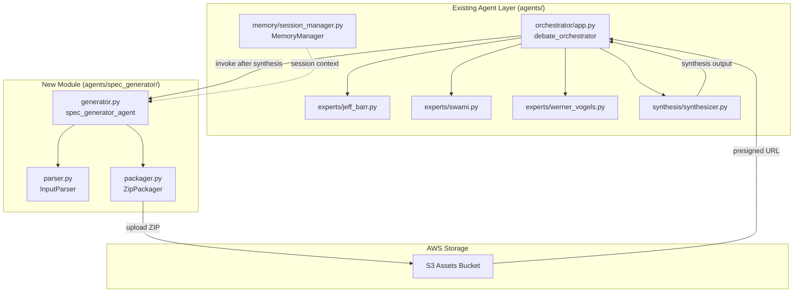

# Design Document

## Overview

The Spec Generator Agent is a Strands-based AI agent that transforms the synthesized architecture from the Disagree and Commit debate into a complete, downloadable Kiro spec package. It operates as the final stage in the debate pipeline, taking the over-engineered architecture (complete with Mermaid diagrams and trade-off analysis) and generating three structured documents: requirements.md, design.md, and tasks.md.

The agent follows the same patterns established in the existing `agents/` codebase:
- Uses `strands.Agent` with `BedrockModel` (Claude Sonnet 4.1) like the expert agents
- Follows the module structure pattern (`agents/spec_generator/__init__.py`, `generator.py`)
- Integrates with the existing `MemoryManager` for session context
- Is invoked by the `debate_orchestrator` in `agents/orchestrator/app.py` after synthesis

The generated spec package is bundled into a ZIP file, uploaded to S3, and made available via a presigned URL for download. Users can then extract this into their own `.kiro/specs/` directory and use Kiro to implement the absurd architecture the panel designed.

## Architecture



### Integration with Existing Code

The spec generator integrates with the existing orchestrator flow in `agents/orchestrator/app.py`:

```python
# After synthesis completes (existing code around line 130)
synthesis_result = synthesis_agent.run(synthesis_prompt)
synthesis_text = synthesis_result.message
mermaid_diagram = extract_mermaid(synthesis_text)

# NEW: Generate Kiro spec package
from spec_generator import generate_spec_package
spec_result = generate_spec_package(
    problem=problem,
    synthesis_output=synthesis_text,
    mermaid_diagram=mermaid_diagram,
    session_id=session_id
)

# Return includes spec download URL
return {
    "sessionId": session_id,
    "synthesis": synthesis_text,
    "mermaidDiagram": mermaid_diagram,
    "specDownloadUrl": spec_result.download_url,  # NEW
    "status": "complete"
}
```

### Module Structure

Following the existing `agents/` directory patterns:

```
agents/
├── experts/
│   ├── __init__.py          # exports jeff_barr_agent, swami_agent, werner_agent
│   ├── jeff_barr.py
│   ├── swami.py
│   └── werner_vogels.py
├── memory/
│   ├── __init__.py          # exports MemoryManager
│   └── session_manager.py
├── synthesis/
│   ├── __init__.py          # exports synthesis_agent, extract_mermaid
│   └── synthesizer.py
├── spec_generator/          # NEW MODULE
│   ├── __init__.py          # exports spec_generator_agent, generate_spec_package
│   ├── generator.py         # Strands agent + main generate_spec_package()
│   ├── parser.py            # InputParser class + extract utilities
│   └── packager.py          # ZipPackager class for S3 upload
├── orchestrator/
```

**Expected `agents/spec_generator/__init__.py`** (following `agents/synthesis/__init__.py` pattern):

```python
"""Spec generator module for creating Kiro spec packages from synthesis output."""

from .generator import spec_generator_agent, generate_spec_package

__all__ = ['spec_generator_agent', 'generate_spec_package']
```

### Data Flow

1. `debate_orchestrator` completes 3 rounds and invokes `synthesis_agent`
2. After synthesis, orchestrator invokes `generate_spec_package()` with synthesis output
3. `InputParser` extracts components, services, Mermaid diagram, and trade-offs
4. `spec_generator_agent` generates three markdown documents using Claude
5. `ZipPackager` bundles documents into `.kiro/specs/{feature-name}/` structure
6. ZIP uploaded to S3, presigned URL generated
7. Orchestrator returns result with `specDownloadUrl` field

## Components and Interfaces

### Spec Generator Agent

**Location**: `agents/spec_generator/generator.py`

**Responsibility**: Transform synthesis output into Kiro spec package

Following the same pattern as `agents/synthesis/synthesizer.py`:

```python
from strands import Agent
from strands.models import BedrockModel

spec_generator_agent = Agent(
    model=BedrockModel(model_id="anthropic.claude-sonnet-4-v1"),
    system_prompt="""Generate a complete Kiro spec package from synthesized architecture.

INPUT: Synthesis output containing:
- Architecture Overview
- Core Components
- Mermaid Diagram
- Trade-offs

OUTPUT: Three markdown documents following Kiro conventions:
1. requirements.md - EARS-formatted requirements with user stories
2. design.md - Technical design with interfaces and correctness properties
3. tasks.md - Implementation checklist with property test tasks

GENERATION RULES:
- Preserve the satirical over-engineering while maintaining technical validity
- Use EARS patterns for all acceptance criteria
- Generate correctness properties using "*For any*" format
- Reference requirements in tasks using "_Requirements: X.Y_" format
- Mark property test tasks as optional with "*" suffix
- Include checkpoint tasks for test verification

FORMAT REQUIREMENTS:
- Proper markdown with headers, code blocks, lists
- TypeScript interfaces for frontend components
- Python dataclasses for backend models
- Mermaid diagrams preserved exactly as provided"""
)

# Set the agent name after initialization (following existing pattern)
spec_generator_agent.name = "spec_generator"
```

### Input Parser

**Location**: `agents/spec_generator/parser.py`

**Responsibility**: Extract structured data from synthesis output (similar to `extract_mermaid` in synthesizer.py)

```python
import re
from dataclasses import dataclass
from typing import List, Optional

@dataclass
class ParsedArchitecture:
    """Structured representation of synthesis output."""
    overview: str
    components: List[Component]
    mermaid_diagram: str
    trade_offs: List[TradeOff]
    original_problem: str
    feature_name: str  # kebab-case derived from problem

@dataclass
class Component:
    """A service or module in the architecture."""
    name: str
    service_type: str  # e.g., "Lambda", "DynamoDB", "API Gateway"
    responsibility: str
    relationships: List[str]  # Names of connected components

@dataclass
class TradeOff:
    """A trade-off identified in the synthesis."""
    aspect: str  # e.g., "Simplicity vs Scale"
    jeff_position: str
    swami_position: str
    werner_position: str
    resolution: str

class InputParser:
    def parse(self, synthesis_output: str, problem: str) -> ParsedArchitecture:
        """
        Parse synthesis output into structured architecture.
        
        Args:
            synthesis_output: Raw synthesis text from Synthesis Agent
            problem: Original problem statement
            
        Returns:
            ParsedArchitecture with extracted components
            
        Raises:
            ValueError: If required sections are missing
        """
        pass
    
    def extract_mermaid(self, text: str) -> str:
        """Extract Mermaid diagram from markdown code block."""
        pass
    
    def extract_components(self, text: str) -> List[Component]:
        """Extract component definitions from Core Components section."""
        pass
    
    def derive_feature_name(self, problem: str) -> str:
        """Convert problem statement to kebab-case feature name."""
        pass
```

### Requirements Generator

**Responsibility**: Generate EARS-compliant requirements.md

```python
@dataclass
class GeneratedRequirements:
    """Output from requirements generation."""
    introduction: str
    glossary: List[GlossaryEntry]
    requirements: List[Requirement]
    
@dataclass
class GlossaryEntry:
    term: str
    definition: str

@dataclass
class Requirement:
    number: int
    user_story: UserStory
    acceptance_criteria: List[AcceptanceCriterion]

@dataclass
class UserStory:
    role: str
    feature: str
    benefit: str

@dataclass
class AcceptanceCriterion:
    number: str  # e.g., "1.1", "1.2"
    pattern: str  # EARS pattern type
    text: str

class RequirementsGenerator:
    def generate(self, architecture: ParsedArchitecture) -> str:
        """
        Generate requirements.md content.
        
        Args:
            architecture: Parsed architecture data
            
        Returns:
            Markdown string for requirements.md
        """
        pass
    
    def create_glossary(self, components: List[Component]) -> List[GlossaryEntry]:
        """Extract AWS services and terms for glossary."""
        pass
    
    def create_user_story(self, component: Component) -> UserStory:
        """Generate user story from component."""
        pass
    
    def create_acceptance_criteria(
        self, 
        component: Component, 
        req_number: int
    ) -> List[AcceptanceCriterion]:
        """Generate EARS-formatted acceptance criteria."""
        pass
```

### Design Generator

**Responsibility**: Generate design.md with interfaces and properties

```python
@dataclass
class GeneratedDesign:
    """Output from design generation."""
    overview: str
    architecture_diagram: str  # Mermaid
    components_interfaces: str  # TypeScript/Python code
    data_models: str
    correctness_properties: List[CorrectnessProperty]
    error_handling: str
    testing_strategy: str

@dataclass
class CorrectnessProperty:
    number: int
    name: str
    description: str  # "*For any* X, Y SHALL Z"
    validates: str  # "Requirements X.Y"

class DesignGenerator:
    def generate(
        self, 
        architecture: ParsedArchitecture,
        requirements: GeneratedRequirements
    ) -> str:
        """
        Generate design.md content.
        
        Args:
            architecture: Parsed architecture data
            requirements: Generated requirements for property derivation
            
        Returns:
            Markdown string for design.md
        """
        pass
    
    def generate_interfaces(self, components: List[Component]) -> str:
        """Generate TypeScript/Python interface definitions."""
        pass
    
    def generate_data_models(self, components: List[Component]) -> str:
        """Generate data model definitions."""
        pass
    
    def derive_properties(
        self, 
        criteria: List[AcceptanceCriterion]
    ) -> List[CorrectnessProperty]:
        """Derive correctness properties from acceptance criteria."""
        pass
```

### Tasks Generator

**Responsibility**: Generate tasks.md with implementation checklist

```python
@dataclass
class GeneratedTasks:
    """Output from tasks generation."""
    tasks: List[Task]

@dataclass
class Task:
    number: str  # e.g., "1", "2.1", "2.2"
    description: str
    is_optional: bool  # True for property test tasks
    sub_tasks: List[Task]
    requirements_refs: List[str]  # e.g., ["1.1", "2.3"]
    property_ref: Optional[str]  # e.g., "Property 3: Component extraction"

class TasksGenerator:
    def generate(
        self,
        architecture: ParsedArchitecture,
        requirements: GeneratedRequirements,
        design: GeneratedDesign
    ) -> str:
        """
        Generate tasks.md content.
        
        Args:
            architecture: Parsed architecture data
            requirements: Generated requirements for references
            design: Generated design for property references
            
        Returns:
            Markdown string for tasks.md
        """
        pass
    
    def create_setup_tasks(self, architecture: ParsedArchitecture) -> List[Task]:
        """Generate project setup tasks."""
        pass
    
    def create_component_tasks(self, components: List[Component]) -> List[Task]:
        """Generate implementation tasks for each component."""
        pass
    
    def create_property_test_tasks(
        self, 
        properties: List[CorrectnessProperty]
    ) -> List[Task]:
        """Generate optional property test tasks."""
        pass
    
    def create_checkpoint_tasks(self) -> List[Task]:
        """Generate checkpoint tasks for test verification."""
        pass
```

### ZIP Packager

**Location**: `agents/spec_generator/packager.py`

**Responsibility**: Bundle spec documents and upload to S3

```python
import zipfile
import boto3
from io import BytesIO
import os

@dataclass
class SpecPackage:
    """Generated spec package."""
    feature_name: str
    requirements_md: str
    design_md: str
    tasks_md: str

@dataclass
class PackageResult:
    """Result of packaging operation."""
    zip_key: str  # S3 object key
    download_url: str  # Presigned URL
    expires_at: str  # ISO8601 timestamp

class ZipPackager:
    def __init__(self, s3_bucket: str):
        self.s3 = boto3.client('s3')
        self.bucket = s3_bucket
    
    def package(self, spec: SpecPackage) -> PackageResult:
        """
        Create ZIP and upload to S3.
        
        Args:
            spec: Generated spec documents
            
        Returns:
            PackageResult with download URL
        """
        pass
    
    def create_zip(self, spec: SpecPackage) -> BytesIO:
        """
        Create in-memory ZIP file with folder structure.
        
        Structure:
        .kiro/
          specs/
            {feature-name}/
              requirements.md
              design.md
              tasks.md
        """
        pass
    
    def upload_to_s3(self, zip_buffer: BytesIO, key: str) -> None:
        """Upload ZIP to S3 assets bucket."""
        pass
    
    def generate_presigned_url(self, key: str, expiration: int = 86400) -> str:
        """Generate presigned URL with 24-hour expiration."""
        pass
```

## Data Models

### Synthesis Input Format

```python
@dataclass
class SynthesisOutput:
    """Input received from Synthesis Agent."""
    session_id: str
    problem: str
    architecture_overview: str
    core_components: str
    mermaid_diagram: str
    trade_offs: str
    expert_positions: Dict[str, str]  # jeff, swami, werner final positions
```

### Orchestrator Response Format

The `debate_orchestrator()` function returns an extended response including spec generation results:

**Successful Response** (with spec):
```python
{
    "sessionId": "debate_a3f2b1c4_2025-11-30T12:00:00Z",
    "synthesis": "## Architecture Overview\n...",
    "mermaidDiagram": "graph TD\n  A[User] --> B[API Gateway]...",
    "specDownloadUrl": "https://s3.amazonaws.com/bucket/specs/debate_a3f2b1c4.zip?...",
    "specFeatureName": "mars-digital-currency",
    "specGenerationStatus": "complete",
    "status": "complete"
}
```

**Successful Response** (spec generation failed but debate succeeded):
```python
{
    "sessionId": "debate_a3f2b1c4_2025-11-30T12:00:00Z",
    "synthesis": "## Architecture Overview\n...",
    "mermaidDiagram": "graph TD\n  A[User] --> B[API Gateway]...",
    "specDownloadUrl": None,
    "specFeatureName": None,
    "specGenerationStatus": "failed",
    "specError": "Failed to parse synthesis output: missing Mermaid diagram",
    "status": "complete"  # Debate still succeeded
}
```

Note: WebSocket message emission is handled by the UI infrastructure spec (`.kiro/specs/disagree-and-commit-ui/`). The orchestrator returns data that the WebSocket layer transforms into real-time messages.

### Generated Document Templates

**requirements.md structure**:
```markdown
# Requirements Document

## Introduction
[Generated summary of the over-engineered architecture]

## Glossary
- **Term**: Definition
...

## Requirements

### Requirement 1
**User Story:** As a [role], I want [feature], so that [benefit]

#### Acceptance Criteria
1. WHEN [event] THEN the [System] SHALL [response]
2. WHILE [state] THEN the [System] SHALL [response]
...
```

**design.md structure**:
```markdown
# Design Document

## Overview
[Architecture philosophy and approach]

## Architecture
```mermaid
[Preserved Mermaid diagram]
```

## Components and Interfaces
[TypeScript/Python interfaces]

## Data Models
[Data structure definitions]

## Correctness Properties
*A property is a characteristic or behavior...*

**Property 1: [Name]**
*For any* [input], [condition] SHALL [outcome]
**Validates: Requirements X.Y**
...

## Error Handling
[Error scenarios and handling]

## Testing Strategy
[Property-based testing approach]
```

**tasks.md structure**:
```markdown
# Implementation Plan

- [ ] 1. Set up project structure
  - Create directory structure
  - Install dependencies
  - _Requirements: 1.1_

- [ ] 2. Implement core component
  - [ ] 2.1 Create main interface
    - Implementation details
    - _Requirements: 2.1, 2.2_
  
  - [ ]* 2.2 Write property test
    - **Property 1: [Name]**
    - **Validates: Requirements 2.1**

- [ ] 3. Checkpoint - Ensure all tests pass
  - Ensure all tests pass, ask the user if questions arise.
...
```

## Correctness Properties

*A property is a characteristic or behavior that should hold true across all valid executions of a system-essentially, a formal statement about what the system should do. Properties serve as the bridge between human-readable specifications and machine-verifiable correctness guarantees.*

### Input Processing Properties

**Property 1: Mermaid diagram round-trip preservation**
*For any* valid synthesis output containing a Mermaid diagram, the generated design.md SHALL contain the exact same Mermaid diagram code block.
**Validates: Requirements 1.2, 3.2**

**Property 2: Synthesis input completeness**
*For any* synthesis output, the Spec Generator SHALL receive and process all four required sections: architecture overview, core components, Mermaid diagram, and trade-offs.
**Validates: Requirements 1.1**

**Property 3: Component extraction accuracy**
*For any* synthesis output with N distinct service names in the core components section, the parser SHALL extract exactly N Component objects with non-empty name, service_type, and responsibility fields.
**Validates: Requirements 1.3**

**Property 4: Malformed input rejection**
*For any* synthesis input missing required sections (overview, components, diagram, or trade-offs), the Spec Generator SHALL return an error indicating which sections are missing.
**Validates: Requirements 1.4**

### Requirements Generation Properties

**Property 5: Document structure completeness**
*For any* valid synthesis input, the generated requirements.md SHALL contain an Introduction section, a Glossary section, and at least one numbered Requirement section.
**Validates: Requirements 2.1**

**Property 6: Glossary completeness**
*For any* architecture containing AWS service references, the generated glossary SHALL contain a definition entry for each unique AWS service mentioned.
**Validates: Requirements 2.2**

**Property 7: Requirements count relationship**
*For any* architecture with N major components, the generated requirements.md SHALL contain at least N numbered requirements, each with a user story in "As a [role], I want [feature], so that [benefit]" format.
**Validates: Requirements 2.3, 2.5**

**Property 8: EARS pattern compliance**
*For any* generated acceptance criterion, the text SHALL match one of the EARS patterns: "WHEN...THEN...SHALL", "WHILE...SHALL", "IF...THEN...SHALL", or "WHERE...SHALL".
**Validates: Requirements 2.4**

### Design Generation Properties

**Property 9: Interface definitions presence**
*For any* generated design.md, the Components and Interfaces section SHALL contain at least one TypeScript interface or Python class definition with type annotations.
**Validates: Requirements 3.3**

**Property 10: Data models presence**
*For any* generated design.md, the Data Models section SHALL contain at least one data structure definition (TypeScript interface, Python dataclass, or JSON schema).
**Validates: Requirements 3.4**

**Property 11: Correctness property derivation**
*For any* generated design.md with N testable acceptance criteria in the corresponding requirements.md, the Correctness Properties section SHALL contain at least N/2 properties (accounting for consolidation).
**Validates: Requirements 3.5**

**Property 12: Correctness property format**
*For any* correctness property in the generated design.md, the property description SHALL begin with "*For any*" and contain "SHALL".
**Validates: Requirements 7.2**

### Tasks Generation Properties

**Property 13: Task checkbox format**
*For any* task in the generated tasks.md, the task SHALL be formatted as a markdown checkbox item starting with "- [ ]" or "- [ ]*".
**Validates: Requirements 4.1**

**Property 14: Task logical ordering**
*For any* generated tasks.md, setup tasks SHALL appear before implementation tasks, and implementation tasks SHALL appear before integration and testing tasks.
**Validates: Requirements 4.2**

**Property 15: Sub-task structure**
*For any* task with multiple implementation steps, the task SHALL contain sub-tasks with decimal notation (e.g., "2.1", "2.2").
**Validates: Requirements 4.3**

**Property 16: Task requirement references**
*For any* implementation task in the generated tasks.md, the task SHALL contain a requirements reference in the format "_Requirements: X.Y_" or "_Requirements: X.Y, Z.W_".
**Validates: Requirements 4.4, 7.3**

**Property 17: Optional test task marking**
*For any* property-based test task in the generated tasks.md, the task SHALL be marked as optional with the "- [ ]*" prefix.
**Validates: Requirements 4.5**

**Property 18: Checkpoint task presence**
*For any* generated tasks.md, there SHALL be at least one checkpoint task containing "Ensure all tests pass".
**Validates: Requirements 4.6**

**Property 19: Property test task format**
*For any* property test task in the generated tasks.md, the task SHALL contain both "**Property N: [name]**" and "**Validates: Requirements X.Y**" format elements.
**Validates: Requirements 7.4**

### Packaging Properties

**Property 20: ZIP file creation**
*For any* successful spec generation, the packager SHALL create a valid ZIP file that can be extracted without errors.
**Validates: Requirements 5.1**

**Property 21: ZIP folder structure**
*For any* generated ZIP file, extracting it SHALL produce the folder structure `.kiro/specs/{feature-name}/` containing exactly three files: requirements.md, design.md, and tasks.md.
**Validates: Requirements 5.2**

**Property 22: Feature name kebab-case**
*For any* problem statement, the derived feature name SHALL be in kebab-case format (lowercase letters and hyphens only, no spaces or special characters).
**Validates: Requirements 5.3**

**Property 23: S3 presigned URL format**
*For any* generated download URL, the URL SHALL be a valid S3 presigned URL containing the bucket name, object key, and signature parameters.
**Validates: Requirements 5.4**

### Integration Properties

**Property 24: Orchestrator invocation**
*For any* completed debate with synthesis, the Orchestrator SHALL invoke `generate_spec_package()` exactly once with the complete synthesis output.
**Validates: Requirements 6.1**

**Property 25: Response includes download URL**
*For any* successful spec generation, the orchestrator response SHALL contain a non-empty `specDownloadUrl` field and `specGenerationStatus` of "complete".
**Validates: Requirements 6.3**

**Property 26: Error handling session preservation**
*For any* spec generation failure, the orchestrator response SHALL still contain the synthesis and mermaidDiagram fields, with `specGenerationStatus` of "failed" and `specError` describing the issue.
**Validates: Requirements 6.4**

### Document Quality Properties

**Property 27: Markdown formatting validity**
*For any* generated spec document, the content SHALL be valid markdown with properly closed code blocks, consistent header levels, and valid list formatting.
**Validates: Requirements 7.1**

## Error Handling

| Error Scenario | Handling Strategy |
|----------------|-------------------|
| Missing synthesis sections | Return error listing missing sections, do not generate partial spec |
| Invalid Mermaid syntax | Preserve diagram as-is, add warning comment in design.md |
| S3 upload failure | Retry up to 3 times with exponential backoff, emit error on final failure |
| Presigned URL generation failure | Return S3 object key, suggest manual download |
| Model invocation timeout | Retry once, emit error if second attempt fails |
| ZIP creation failure | Log error, emit WebSocket error, preserve session state |

### Error Response Format

```python
@dataclass
class SpecGenerationError:
    error_type: str  # "parse_error", "generation_error", "packaging_error"
    message: str
    missing_sections: Optional[List[str]]  # For parse errors
    session_id: str
    recoverable: bool
```

## Testing Strategy

### Unit Testing

Unit tests verify individual component behavior:

- **InputParser**: Test extraction of components, Mermaid diagrams, feature name derivation
- **RequirementsGenerator**: Test EARS pattern generation, glossary creation, user story formatting
- **DesignGenerator**: Test interface generation, property derivation, markdown structure
- **TasksGenerator**: Test task ordering, reference formatting, optional marking
- **ZipPackager**: Test ZIP creation, folder structure, S3 upload

### Property-Based Testing

Property-based tests use **Hypothesis** for Python with minimum 100 iterations per test.

**Configuration**:
```python
from hypothesis import given, settings, strategies as st

@settings(max_examples=100, deadline=None)
```

**Test Tagging Convention**:
```python
# Feature: spec-generator-agent, Property 1: Mermaid diagram round-trip preservation
```

**Generator Strategies**:
```python
# Synthesis output generator
synthesis_outputs = st.fixed_dictionaries({
    'architecture_overview': st.text(min_size=50, max_size=500),
    'core_components': st.text(min_size=100, max_size=1000),
    'mermaid_diagram': mermaid_diagrams(),  # Custom strategy
    'trade_offs': st.text(min_size=50, max_size=500)
})

# Mermaid diagram generator
@st.composite
def mermaid_diagrams(draw):
    nodes = draw(st.lists(st.text(min_size=1, max_size=20), min_size=2, max_size=10))
    edges = [(nodes[i], nodes[i+1]) for i in range(len(nodes)-1)]
    diagram = "graph TD\n"
    for src, dst in edges:
        diagram += f"    {src} --> {dst}\n"
    return diagram

# Problem statement generator
problem_statements = st.text(min_size=10, max_size=200)

# Component generator
components = st.fixed_dictionaries({
    'name': st.text(min_size=1, max_size=30),
    'service_type': st.sampled_from(['Lambda', 'DynamoDB', 'API Gateway', 'S3', 'SQS']),
    'responsibility': st.text(min_size=10, max_size=100)
})
```

### Integration Testing

Integration tests verify end-to-end spec generation:

1. **Full Pipeline Test**: Submit synthesis output, verify all three documents generated
2. **ZIP Extraction Test**: Download ZIP, extract, verify folder structure and file contents
3. **WebSocket Message Test**: Verify correct message sequence (started → ready/error)
4. **Error Recovery Test**: Simulate failures, verify session preservation

