# End-to-End Conversation: Mars/Moon Digital Currency

**Problem Statement:** How to build a robust digital currency system once we move to Mars or Moon? Consider: 8-22 minute communication delay with Earth, need for offline transactions, extreme reliability requirements, multi-planetary consensus, and AWS services architecture.

---

## Round 1: Initial Positions

### Jeff Barr (The Simplifier)

Here's the simple approach - we use AWS Lambda at the edge with Local Zones on Mars and Moon. Each planetary node runs a lightweight ledger using DynamoDB Global Tables with conflict resolution. For offline transactions, we leverage Step Functions to queue and batch-process when connectivity returns.

The beauty is EventBridge handles the async communication between planets. No complex infrastructure to manage. When Earth and Mars can talk, Global Tables sync automatically. When they can't, local transactions continue with Lambda processing them instantly.

We add S3 for transaction logs with cross-region replication when links are up. Simple, serverless, and it just works. The 22-minute delay? That's just eventual consistency at planetary scale - DynamoDB already handles that pattern perfectly.

---

### Swami (The Shipper)

We can ship this in weeks using Amazon Bedrock for fraud detection and SageMaker for transaction pattern analysis. Here's the AI angle - we train models on Earth, deploy them everywhere using SageMaker Edge Manager.

Each planetary node gets a local Bedrock agent that approves transactions instantly using learned patterns. No waiting for Earth approval. The AI adapts to new fraud patterns locally, then syncs models back when connectivity allows.

For consensus, we use Amazon Managed Blockchain - it's literally built for distributed trust. Deploy a Hyperledger Fabric network with nodes on each planet. Transactions are instant locally, eventual globally. The AI handles 99% of decisions, humans only intervene for anomalies.

Speed to market is everything. We launch with basic features, iterate based on actual Mars usage data. The AI gets smarter every day.

---

### Werner Vogels (The Scale Architect)

At scale, we need to think about billions of transactions across multiple planets with unreliable links. This requires a fundamentally distributed architecture with no single point of failure.

We build a gossip protocol on top of AWS Outposts deployed on each celestial body. Each Outpost runs a complete copy of the transaction system - Aurora for local consensus, ElastiCache for sub-millisecond transaction validation, and Kinesis for event streaming.

The key is partition tolerance. When Mars loses contact with Earth for days, life continues. We use vector clocks and CRDTs for conflict-free eventual consistency. AWS Transit Gateway connects planetary networks when available, but each planet operates autonomously.

For security at this scale, we need AWS Nitro Enclaves running on every node, cryptographic proof of transactions, and AWS KMS with CloudHSM for key management that works offline. We're talking about a currency that could run a trillion-person economy across the solar system.

---

## Round 2: Debate and Refinement

### Jeff Barr

Werner, you're over-engineering this. Outposts on Mars? That's massive infrastructure to ship and maintain. We don't need gossip protocols when EventBridge and Global Tables already solve this.

Swami's AI approach is interesting, but we don't need Blockchain - that's just adding complexity. DynamoDB with conditional writes gives us the consistency we need without the overhead.

Here's the refined approach: Lambda@Edge on each planet, DynamoDB Global Tables for the ledger, and S3 for immutable transaction logs. Add Bedrock for fraud detection like Swami suggested - that's smart. But keep it simple.

For offline periods, we use DynamoDB local transactions with conflict resolution rules. When planets reconnect, Global Tables merge automatically. We can ship this in a month, not years. The infrastructure cost is minimal because it's all serverless.

---

### Swami

Jeff, I love the serverless angle, but DynamoDB alone won't give us the cryptographic guarantees a currency needs. Werner's right about security - we need Nitro Enclaves and proper key management.

But Werner, we don't need Outposts. We can run everything on Lambda with Bedrock agents making real-time decisions. Here's the hybrid: use Amazon QLDB for the immutable ledger - it's serverless AND gives us cryptographic verification.

Each planet runs QLDB locally, Bedrock agents approve transactions instantly, and we sync ledgers when connectivity allows. SageMaker models detect fraud patterns, and we use AWS Secrets Manager for key rotation that works offline.

The AI is the differentiator. It learns from transaction patterns on each planet and adapts to local economies. Mars might develop different spending patterns than Moon - our system adapts automatically. We can launch a beta in 6 weeks.

---

### Werner Vogels

You're both thinking too small. This isn't about launching fast - it's about building a system that lasts centuries and scales to millions of people per planet.

Jeff, serverless is great until you hit the limits. Lambda has a 15-minute timeout - what happens during a 22-minute communication window? Swami, QLDB is interesting but it's not designed for partition tolerance at planetary scale.

We need Aurora Global Database with write forwarding disabled - each planet is a write region. For consensus across planets, we implement a Raft-based protocol using ECS Anywhere running on local compute. This gives us strong consistency within a planet, eventual consistency between planets.

Add AWS IoT Core for device-level transactions - people's wallets need to work in Mars caves with no connectivity. We use AWS Greengrass for edge computing on individual devices. Every transaction is cryptographically signed, stored in multiple locations, and verified by multiple nodes.

The system must survive a complete loss of Earth. That means full autonomy on each planet with the ability to fork the currency if needed. This is distributed systems at the hardest level.

---

## Round 3: Consensus Building

### Jeff Barr

Okay, I'll concede we need more than just Lambda and DynamoDB. Werner's point about partition tolerance is valid - we need each planet to be fully autonomous.

Here's my consensus: Aurora Global Database for the ledger with each planet as a separate region. Lambda for transaction processing, but we add ECS Fargate for long-running consensus processes. QLDB for immutable audit logs like Swami suggested.

We keep Bedrock for fraud detection and add Nitro Enclaves for key operations. EventBridge orchestrates cross-planet sync when connectivity exists. The key is each planet can operate independently for months if needed.

It's more complex than my initial proposal, but still manageable. We're not shipping Outposts to Mars, but we're building something that actually works at scale.

---

### Swami

I'm aligned with this hybrid approach. Let me add the AI layer that makes it intelligent:

Each planet runs Bedrock agents that learn local transaction patterns. SageMaker models deployed via Edge Manager handle fraud detection with 99.9% accuracy locally. When planets sync, models share learnings.

We use Amazon Personalize to predict transaction behavior and pre-approve common patterns. This reduces latency to milliseconds even with AI in the loop.

For the blockchain piece, I'll compromise - we use QLDB for immutability but not full blockchain. It gives us cryptographic verification without the overhead. AWS KMS with CloudHSM handles keys, and Secrets Manager rotates them automatically.

The system launches with basic AI, gets smarter every day, and adapts to each planetary economy. We can have a working prototype in 8 weeks, production-ready in 6 months.

---

### Werner Vogels

I can support this architecture with some critical additions for true planetary scale:

We need AWS Outposts Servers (not full Outposts) on each planet - minimal hardware footprint but gives us local compute. Aurora Global Database with multi-region writes disabled - each planet is authoritative for its transactions.

Add AWS Transit Gateway for inter-planetary networking when available. Use AWS PrivateLink for secure service-to-service communication. Every component must have a local fallback.

For the consensus mechanism, we implement a modified Paxos protocol using ECS Fargate. This handles the 22-minute delay gracefully. We add CloudWatch for monitoring with local dashboards that work offline.

The critical piece: AWS Backup with local snapshots and cross-planet replication when possible. If Mars loses all data, it can rebuild from Earth's backup.

This architecture supports billions of transactions per day per planet, survives complete isolation for years, and scales to the entire solar system. It's complex, but that's because the problem is complex. We're building infrastructure for a multi-planetary civilization.

---

## Final Synthesis

**Architecture Overview:**

A hybrid serverless-container architecture with full planetary autonomy and eventual cross-planet consistency. Each celestial body operates as an independent financial system that syncs when communication allows.

**Core Components:**

1. **Transaction Layer**: Lambda for instant processing, ECS Fargate for consensus protocols
2. **Data Layer**: Aurora Global Database (per-planet write authority), QLDB for immutable audit logs, DynamoDB for high-speed caching
3. **AI/ML Layer**: Bedrock agents for fraud detection, SageMaker Edge Manager for local model deployment, Amazon Personalize for transaction prediction
4. **Security Layer**: Nitro Enclaves for sensitive operations, AWS KMS with CloudHSM for key management, cryptographic signing for all transactions
5. **Networking Layer**: AWS Transit Gateway for inter-planetary links, EventBridge for async event processing, AWS PrivateLink for secure communication
6. **Edge Layer**: AWS Outposts Servers for local compute, IoT Core for device transactions, Greengrass for offline wallet functionality
7. **Resilience Layer**: AWS Backup with cross-planet replication, CloudWatch with local monitoring, multi-level redundancy

**Trade-offs:**

- **Complexity vs Simplicity**: More complex than pure serverless, but necessary for planetary-scale partition tolerance
- **Speed to Market vs Robustness**: 6-month timeline balances rapid iteration with production-grade reliability
- **Cost vs Capability**: Higher infrastructure cost (Outposts Servers) justified by autonomy requirements
- **Consistency vs Availability**: Eventual consistency between planets, strong consistency within planets - the only viable model given physics

**Mermaid Diagram:**

```mermaid
graph TB
    subgraph Earth["🌍 Earth Region"]
        E_Lambda[Lambda Transaction Processor]
        E_Aurora[(Aurora Primary)]
        E_QLDB[(QLDB Audit Log)]
        E_Bedrock[Bedrock Fraud AI]
        E_Outpost[Outposts Server]
    end
    
    subgraph Mars["🔴 Mars Region"]
        M_Lambda[Lambda Transaction Processor]
        M_Aurora[(Aurora Primary)]
        M_QLDB[(QLDB Audit Log)]
        M_Bedrock[Bedrock Fraud AI]
        M_Outpost[Outposts Server]
    end
    
    subgraph Moon["🌙 Moon Region"]
        L_Lambda[Lambda Transaction Processor]
        L_Aurora[(Aurora Primary)]
        L_QLDB[(QLDB Audit Log)]
        L_Bedrock[Bedrock Fraud AI]
        L_Outpost[Outposts Server]
    end
    
    E_Lambda --> E_Aurora
    E_Lambda --> E_QLDB
    E_Lambda --> E_Bedrock
    E_Outpost --> E_Lambda
    
    M_Lambda --> M_Aurora
    M_Lambda --> M_QLDB
    M_Lambda --> M_Bedrock
    M_Outpost --> M_Lambda
    
    L_Lambda --> L_Aurora
    L_Lambda --> L_QLDB
    L_Lambda --> L_Bedrock
    L_Outpost --> L_Lambda
    
    E_Aurora -.8-22 min delay.-> M_Aurora
    E_Aurora -.8-22 min delay.-> L_Aurora
    M_Aurora -.8-22 min delay.-> L_Aurora
    
    TGW[Transit Gateway]
    E_Outpost --> TGW
    M_Outpost --> TGW
    L_Outpost --> TGW
    
    Users_E[Earth Users] --> E_Lambda
    Users_M[Mars Users] --> M_Lambda
    Users_L[Moon Users] --> L_Lambda
```

**Expert Endorsements:**

- **Jeff Barr**: "It's more complex than I wanted, but each piece serves a purpose. The serverless core keeps operations simple while the edge components handle the hard physics problems. I can support this."

- **Swami**: "The AI layer makes this intelligent and adaptive. We're not just building a currency - we're building a learning financial system. Six months to production is aggressive but achievable. Let's ship it."

- **Werner Vogels**: "This architecture respects the fundamental constraints of distributed systems at planetary scale. Full autonomy, partition tolerance, and eventual consistency - exactly what's needed. It will scale to trillions of transactions across the solar system."
