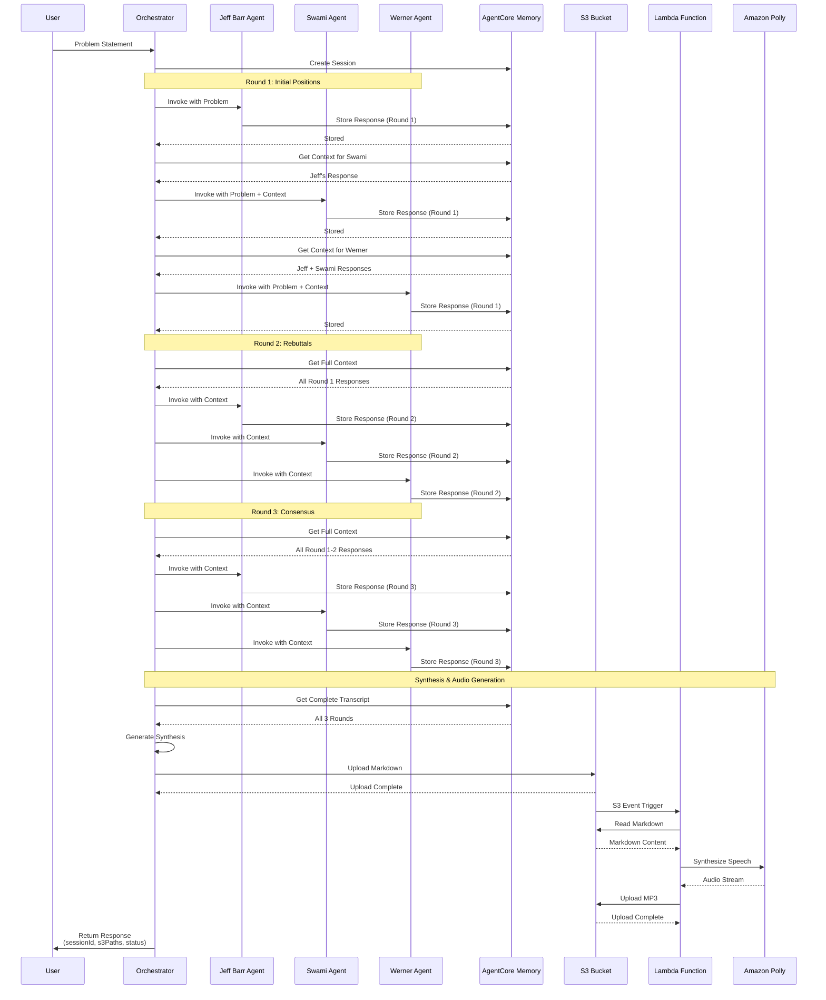
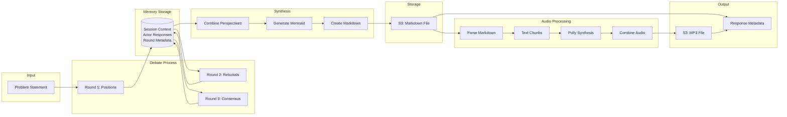
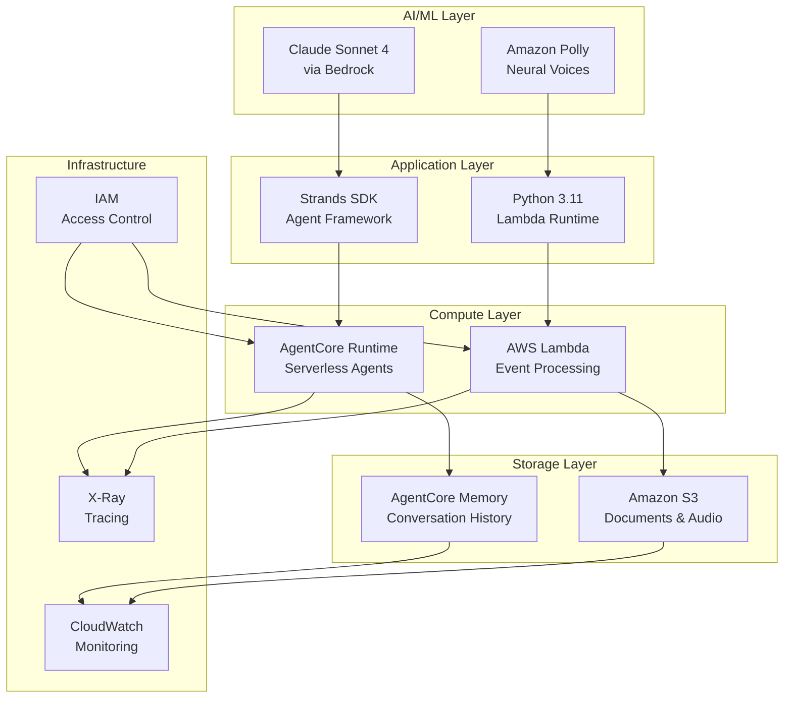

# Disagree-and-Commit System Architecture Diagram

## High-Level Architecture

```mermaid
graph TB
    subgraph "Input Layer"
        User[User/API Request]
        Problem[Problem Statement]
    end
    
    subgraph "AgentCore Runtime Environment"
        Orchestrator[Orchestrator Agent<br/>Coordinates Debate Flow]
        
        subgraph "Expert Agents"
            Jeff[Jeff Barr Agent<br/>Serverless Expert<br/>Claude Sonnet 4]
            Swami[Swami Agent<br/>AI/ML Expert<br/>Claude Sonnet 4]
            Werner[Werner Vogels Agent<br/>Scale Expert<br/>Claude Sonnet 4]
        end
    end
    
    subgraph "Memory Layer"
        Memory[(AgentCore Memory<br/>Session-based Storage<br/>Actor Context)]
    end
    
    subgraph "Storage Layer"
        S3Markdown[S3 Bucket<br/>road-to-reinvent-redteam<br/>{sessionId}/conversation_response/<br/>debate_synthesis.md]
        S3Audio[S3 Bucket<br/>road-to-reinvent-redteam<br/>{sessionId}/audio_response/<br/>debate_synthesis.mp3]
    end
    
    subgraph "Processing Layer"
        Lambda[Lambda Function<br/>Audio Converter<br/>Python 3.11]
        Polly[Amazon Polly<br/>Neural Voice<br/>Text-to-Speech]
    end
    
    User -->|POST /debate| Problem
    Problem -->|1. Problem Statement| Orchestrator
    
    Orchestrator -->|2. Round 1-3<br/>Invoke with Context| Jeff
    Orchestrator -->|2. Round 1-3<br/>Invoke with Context| Swami
    Orchestrator -->|2. Round 1-3<br/>Invoke with Context| Werner
    
    Jeff -->|3. Store Response<br/>create_event| Memory
    Swami -->|3. Store Response<br/>create_event| Memory
    Werner -->|3. Store Response<br/>create_event| Memory
    
    Memory -->|4. Retrieve Context<br/>retrieve_memory| Jeff
    Memory -->|4. Retrieve Context<br/>retrieve_memory| Swami
    Memory -->|4. Retrieve Context<br/>retrieve_memory| Werner
    
    Orchestrator -->|5. Get Full Context<br/>All Rounds| Memory
    Orchestrator -->|6. Generate Synthesis<br/>Markdown Document| S3Markdown
    
    S3Markdown -->|7. S3 Event<br/>ObjectCreated| Lambda
    Lambda -->|8. Read Markdown| S3Markdown
    Lambda -->|9. Convert Text| Polly
    Polly -->|10. Audio Stream| Lambda
    Lambda -->|11. Upload MP3| S3Audio
    
    Orchestrator -->|12. Return Response| User
    
    style Orchestrator fill:#FF9900
    style Jeff fill:#232F3E
    style Swami fill:#232F3E
    style Werner fill:#232F3E
    style Memory fill:#3F8624
    style S3Markdown fill:#569A31
    style S3Audio fill:#569A31
    style Lambda fill:#FF9900
    style Polly fill:#FF9900
```

## Detailed Debate Flow



## Data Flow Architecture



## Component Interaction Matrix

| Component | Interacts With | Protocol/API | Purpose |
|-----------|---------------|--------------|---------|
| Orchestrator | Expert Agents | Strands SDK | Invoke agents with prompts |
| Expert Agents | AgentCore Memory | bedrock-agent-runtime | Store responses |
| Expert Agents | AgentCore Memory | bedrock-agent-runtime | Retrieve context |
| Orchestrator | AgentCore Memory | bedrock-agent-runtime | Get full transcript |
| Orchestrator | S3 | boto3 s3 | Upload markdown |
| S3 | Lambda | Event Notification | Trigger on upload |
| Lambda | S3 | boto3 s3 | Read markdown |
| Lambda | Polly | boto3 polly | Convert to speech |
| Lambda | S3 | boto3 s3 | Upload audio |

## Technology Stack


